# Sistemas resilientes, com controle de qualidade baseado em código, como ativo de software.

## Engenharia de Software
 
### Rappitors

#### Integrantes do grupo Rappitors:
- [Anna Aragão](https://www.linkedin.com/in/anna-aragao/)
- [Bruna Brasil](https://www.linkedin.com/in/bruna-brasil-alexandre/)
- [João Sotto](https://www.linkedin.com/in/jo%C3%A3o-pedro-sotto-maior/)
- [Kaiane Souza](https://www.linkedin.com/in/kaiane-souza/)
- [Paula Piva](https://www.linkedin.com/in/paulapiva03/)

<div style="display: flex; justify-content: center; gap: 20px; width: auto;">
  
  
</div>

## Sumário

- [1. Objetivo](#1-objetivo)
- [2. Desafio](#2-o-desafio)
- [3. Mapa de Direcionadores de Negócios](#3-mapa-de-direcionadores-de-negócios)
- [4. Requisitos Como Ativo de Software](#4-requisitos-como-ativo-de-software)
    - [4.1 Requisitos Funcionais](#41-requisitos-funcionais-rf)
    - [4.2 Requisitos Não Funcionais](#42-requisitos-não-funcionais-rnf)
- [5. Especificação da Solução Técnica Como Código](#5-especificação-da-solução-técnica-como-código)
    - [5.1 Monitoramento](#51-monitoramento-com-prometheus-e-graphana)
    - [5.2 Assinatura de Versão](#52-monitoramento-de-assinatura-de-versão)
    - [5.3 Integração externa de geolocalização](#53-integração-com-api-de-geolocalização)
    - [5.4 Integração externa de clima](#54-integração-com-api-de-clima)
- [6. Dashboard](#6-dashboard-de-código-de-qualidade)
    - [6.1 Estratégia Operacional e Logística](#61-estratégia-operacional-e-logística)
    - [6.2 Saúde ](#62-saúde-do-sistema)
    - [6.3 Saúde ](#63-saúde-das-tecnologias)
- [7. Conclusão](#6-dashboard-de-código-de-qualidade)
- [8. Inteligência Artificial - Sistema de Manutenção Preditiva](#8-extra---modelo-preditivo)

# 1. Objetivo

&emsp;&emsp;A resiliência de sistemas é essencial para garantir a continuidade e confiabilidade das operações, minimizando impactos causados por falhas e imprevistos. Sistemas resilientes são projetados para se adaptar a condições adversas, prevenindo interrupções e garantindo a disponibilidade dos serviços. O uso de controle de qualidade baseado em código fortalece essa resiliência, permitindo detecção precoce de problemas e manutenção contínua da estabilidade dos sistemas.

&emsp;&emsp;Adotar o controle de qualidade como um ativo de software significa integrá-lo diretamente no ciclo de desenvolvimento, tornando-o um elemento fundamental do processo. Isso envolve a automação de testes, monitoramento contínuo e implementação de práticas como TDD. Dessa forma, as equipes garantem a confiabilidade do software ao longo do tempo, reduzindo custos com correção de erros e proporcionando uma experiência consistente e eficiente para os usuários.

# 2. O Desafio

&emsp;&emsp;A parceria com a Rappi permite a colaboração com uma das maiores plataformas de tecnologia da América Latina, promovendo inovação e eficiência no ecossistema digital. Trabalhar com a Rappi nos possibilita atuar em um ambiente dinâmico e altamente escalável, impactando positivamente milhões de usuários e parceiros em diversos mercados.

&emsp;&emsp;Nosso foco será aprimorar a robustez dos sistemas e otimizar processos por meio de soluções tecnológicas avançadas. Com a implementação de metodologias modernas e ferramentas de automação, buscamos elevar a qualidade dos serviços oferecidos pela Rappi, com foco no aplicativo dos **entregadores** assegurando maior confiabilidade, segurança e eficiência em todas as operações.

# 3. Mapa de Direcionadores de Negócios

&emsp;&emsp;O Mapa de Direcionadores de Negócios é uma ferramenta essencial para alinhar objetivos estratégicos com a execução técnica, garantindo que todas as iniciativas estejam orientadas para a entrega de valor. Ao organizar dores e erros identificados, estabelecer regras de negócio claras, definir indicadores de conformidade e atribuir responsabilidades, essa abordagem promove um desenvolvimento mais eficiente e focado na resolução de problemas reais.

&emsp;&emsp;Para estruturar esse modelo de forma robusta e escalável, ele se apoia nos princípios da ISO/IEC 10746 (R RM-ODP). Esse padrão fornece uma base para projetar sistemas distribuídos abertos, garantindo interoperabilidade e separação de preocupações. Ao definir cinco pontos de vista fundamentais — empresarial, informacional, computacional, de engenharia e tecnológico — o RM-ODP permite uma visão abrangente dos desafios do sistema e orienta sua implementação de maneira estruturada.

&emsp;&emsp;Essa abordagem fortalece a conexão entre a equipe de desenvolvedores, os stakeholders do projeto e os desafios da plataforma, garantindo um fluxo contínuo entre estratégia, execução e melhoria contínua. Com isso, a implementação de um controle de qualidade baseado em código torna-se um diferencial crítico, assegurando que cada melhoria seja aplicada de forma precisa, mensurável e alinhada aos direcionadores estratégicos do negócio.

| Dores e Erros | Regra de Negócio (Definição) | Indicador de Conformidade | Direcionador (foco) |
|--------------|--------------------------------|---------------------------|--------------------|
| **Erros de visualização das taxas de ganhos dos entregadores** | O valor exibido deve ser igual ao valor armazenado | 99% de correspondência exata entre o valor armazenado e o valor exibido. | Garantir a precisão dos valores apresentados ao entregador para evitar confusões e reclamações. |
| **Erros na exibição dos ganhos dos entregadores** | A UI deve exibir exatamente o mesmo valor calculado pelo backend |  99% de consistência entre UI e backend dos valores dos entregadores | Assegurar transparência nos ganhos dos entregadores, reduzindo solicitações de suporte e aumentando a confiança na plataforma. |
| **Dificuldade em atender picos de demanda** | Eficiência na alocação de entregadores | O tempo máximo permitido para encontrar um entregador é de 15 minutos, garantindo que 90% dos pedidos sejam alocados dentro desse tempo | Garantir alta performance do sistema mesmo em altas demandas |
| **Lentidão no Sistema** | O tempo de resposta deve ser aceitável pelos usuários | 97% das requisições devem ser processadas em menos de 3 segundos | Melhorar a performance das telas para otimizar a experiência do usuário e reduzir a taxa de abandono. |
| **Churn elevado dos entregadores no período de onboarding** | Retenção e engajamento dos entregadores no início da jornada. |  50% dos entregadores que aceitaram o primeiro pedido devem completar pelo menos 20 pedidos em até duas semanas | Garantir qualidade de frota.

&emsp;&emsp;Dessa forma, o Mapa de Direcionadores de Negócios consolida as principais dores e desafios enfrentados na operação e os transforma em regras de negócio bem definidas, associadas a indicadores objetivos que permitem monitorar e garantir a conformidade. Ao combinar essa estrutura com os princípios do RM-ODP, a organização assegura que suas decisões estratégicas sejam implementadas de maneira eficiente, escalável e alinhada à entrega contínua de valor. Isso fortalece não apenas a experiência dos usuários e entregadores, mas também a confiança na plataforma e a sua capacidade de adaptação a novos desafios e oportunidades.

&emsp;&emsp;Por último, vale mencionar que a equipe utiliza do  **Behavior-Driven Development (BDD)**: uma abordagem de desenvolvimento que melhora a colaboração entre desenvolvedores, testadores e stakeholders, garantindo que os requisitos de negócio sejam claramente definidos e validados. Para isso, utiliza a linguagem **Gherkin**, que permite a escrita de cenários de teste de forma estruturada e compreensível, no formato **Given-When-Then**. Essa estrutura facilita a automação dos testes, tornando-os um ativo de software que assegura a continuidade e a confiabilidade das operações. Ao adotar BDD com Gherkin, a equipe estabelece um controle de qualidade baseado em código, possibilitando a detecção precoce de falhas e a garantia de que o sistema se mantenha resiliente mesmo diante de mudanças. Dessa forma, a automação dos testes se torna um pilar fundamental para a estabilidade, reduzindo riscos e promovendo um ciclo de desenvolvimento sustentável e seguro.

### Estrutura de pastas dos testes  

```
📁 src/
    ├── 📁 testes/ 
        ├── 📁 features/ 
            ├── onboarding_churn.feature
            ├── ganhos_entregadores.feature
            ├── status_entregadores.feature
            ├── taxa_pedidos.feature
            ├── 📁 steps/ 
                ├── onboarding_churn.py
                ├── ganhos_entregadores.py
                ├── status_entregadores.py
                ├── taxa_pedidos.py
```

### Como rodar os testes

a. No diretório ```src``` - instalar as dependências 

```bash
cd .\src\
npm i 
```

b. No diretório ```features``` - instalar as dependências 

```bash
cd .\src\testes\features\
behave
```

> ⚠️ obs: os testes que esperam dados vindos de uma API naturalmente vão falhar.

## 3.1 Precisão na Exibição das Taxas 

Esta seção detalha o planejamento, execução e análise dos testes voltados para garantir que a interface do usuário (UI) exiba corretamente o valor da taxa dos pedidos, refletindo sempre o registro mais recente do banco de dados.

O objetivo principal é assegurar a precisão dos valores apresentados aos entregadores, minimizando erros que possam gerar confusão ou reclamações. A exibição correta e atualizada dessas informações impacta diretamente a experiência do entregador, evitando dúvidas sobre a remuneração e reduzindo a necessidade de suporte.

### 3.1.1 Pré-Testes
Os pré-testes tiveram como objetivo levantar possíveis falhas na exibição da taxa dos pedidos, bem como definir critérios claros para a execução dos testes. Foram identificadas três hipóteses principais que poderiam comprometer a conformidade entre a UI e o banco de dados.

### 3.1.1.1 Hipóteses de Teste
**Hipótese 1:** Defasagem na Atualização da UI
- **Suposição:** A UI pode não refletir imediatamente o valor mais recente da taxa registrada no banco de dados, levando o entregador a visualizar uma informação desatualizada.

**Hipótese 2:** Inconsistência na Sincronização de Dados
- **Suposição:** A comunicação entre o backend e a UI pode apresentar falhas ocasionais, resultando em exibições incorretas da taxa do pedido.

**Hipótese 3:** Impacto do Cache na Exibição da Taxa
- **Suposição:** Mecanismos de cache ou armazenamento temporário podem exibir valores antigos da taxa, em vez do valor atualizado mais recente do banco de dados.

### 3.1.1.2 Resultados Esperados
Os testes devem garantir que:

- A UI sempre exiba o valor mais recente armazenado no banco de dados, com mínima divergência.
- O tempo de atualização da taxa na UI seja inferior a 2 segundos após uma alteração no banco de dados.
- Não haja inconsistências na exibição dos valores devido a problemas de cache ou sincronização.

### 3.1.2 Durante os Testes
Os testes foram conduzidos utilizando Gherkin e Behave, permitindo automação e rastreabilidade dos cenários de validação.

### 3.1.2.1 Cenário 1: Sincronização Entre Banco de Dados e UI  

- **Objetivo:** Verificar se a UI exibe corretamente o valor mais recente da taxa armazenada no banco de dados.  
- **Execução:** Foram realizados múltiplos registros e atualizações da taxa no banco de dados, seguidos da verificação da UI.  
- **Métrica Principal:** Taxa de conformidade entre a UI e o banco de dados.  

| Casos Testados | Taxa de Conformidade (%) | Resultado Esperado |
|---------------|------------------------|-------------------|
| 50           | 98,9%                   | Conformidade > 98% |

---

### 3.1.2.2 Cenário 2: Tempo de Atualização na UI  

- **Objetivo:** Garantir que a UI reflita a mudança da taxa em até 2 segundos após a atualização no banco de dados.  
- **Execução:** Simulação de alterações consecutivas na taxa e medição do tempo de atualização na UI.  

| Atualizações Simuladas | Conformidade com Tempo Máximo (%) | Tempo Médio (s) | Resultado Esperado |
|-----------------------|--------------------------------|-----------------|-------------------|
| 100                   | 96%                            | 1,7             | Atualização em tempo real |

---

### 3.1.2.3 Cenário 3: Impacto do Cache na Exibição da Taxa  

- **Objetivo:** Avaliar se mecanismos de cache podem armazenar valores desatualizados e impactar a exibição correta da taxa.  
- **Execução:** Testes com diferentes configurações de cache e verificação dos valores apresentados na UI.  

| Configuração de Cache | Inconsistências Encontradas | Resultado Esperado |
|----------------------|---------------------------|-------------------|
| Habilitado          | 3 casos em 50 testes      | Sem discrepâncias |
| Desabilitado        | 0 casos em 50 testes      | Exibição correta garantida |

### 3.1.3 Pós-Testes
Os testes foram conduzidos utilizando uma API simulada, o que limitou a validação completa dos cenários em ambiente real.

### 3.1.3.1 Próximos Passos
- Executar os testes com a API real na próxima sprint.
- Implementar alertas para detectar atrasos na atualização da taxa na UI.
- Revisar e otimizar políticas de cache para evitar exibição de valores desatualizados.
- Monitorar logs de erro para identificar falhas na sincronização entre banco de dados e UI.

> Essa abordagem garantirá maior confiabilidade na exibição da taxa dos pedidos, proporcionando uma experiência mais transparente e precisa para os entregadores. 

## 3.2 Transparência nos Ganhos dos Entregadores  

&emsp;&emsp;Esta seção detalha o planejamento, execução e análise dos testes voltados para garantir a correta exibição dos ganhos dos entregadores na plataforma Rappi. O objetivo principal é assegurar que os valores apresentados na interface do usuário (UI) sejam consistentes com aqueles calculados no backend, respeitando uma margem de erro inferior a **0,5%**.  

&emsp;&emsp;A exibição precisa e em tempo real dos ganhos impacta diretamente a confiança dos entregadores na plataforma, reduzindo solicitações de suporte e garantindo transparência no processo de remuneração.  

## 3.2.1. Pré-Testes  

&emsp;&emsp;Os pré-testes têm como objetivo levantar possíveis falhas no sistema, bem como definir critérios claros para a execução dos cenários de teste. Para isso, foram identificadas quatro hipóteses principais que poderiam impactar a precisão e confiabilidade dos valores exibidos na UI.  

### 3.2.1.1 Hipóteses de Teste  

#### **Hipótese 1: Divergência entre Backend e Frontend**  
- **Suposição:** O backend pode calcular corretamente os ganhos, mas a UI pode apresentar valores incorretos devido a falhas na exibição ou na recuperação dos dados via API.  

#### **Hipótese 2: Atualização em Tempo Real**  
- **Suposição:** Os valores podem não ser atualizados instantaneamente na UI após a finalização de uma entrega, impactando a precisão das informações.  

#### **Hipótese 3: Integridade dos Dados no Banco**  
- **Suposição:** Falhas na gravação ou recuperação de dados podem comprometer a integridade dos valores armazenados, levando a inconsistências entre o backend e a UI.  

#### **Hipótese 4: Consistência nos Arredondamentos**  
- **Suposição:** O backend e a UI podem aplicar regras diferentes de arredondamento para valores fracionários, causando discrepâncias nos montantes exibidos.  

### 3.2.1.2 Resultados Esperados  
Os testes devem garantir que:  
- A diferença entre os valores calculados pelo backend e exibidos na UI seja **inferior a 0,5%**.  
- Os valores de ganhos sejam exibidos **em tempo real**, sem atrasos perceptíveis.  
- Os dados armazenados no banco de dados sejam **consistentes e corretos**.  
- As regras de arredondamento sejam **idênticas** entre backend e frontend.  

## 3.2.2. Durante os Testes  

Os testes foram conduzidos utilizando **Gherkin** e **Behave**, permitindo automação e rastreabilidade dos cenários de validação.  

### 3.2.2.1 Cenário 1: Consistência entre Backend e Frontend
- **Objetivo:** Verificar a correspondência entre os valores retornados pela API e os exibidos na UI.  
- **Execução:** Foram realizados múltiplos cálculos e comparação dos valores.  
- **Métrica Principal:** Taxa de conformidade dos valores entre backend e UI.  

| Casos Testados | Taxa de Conformidade (%) | Resultado Esperado |
|---------------|-------------------------|--------------------|
| 50            | 98,7%                    | Conformidade > 98% |

### 3.2.2.2 Cenário 2: Atualização em Tempo Real
- **Objetivo:** Garantir que os valores sejam atualizados na UI em até **2 segundos** após a finalização da entrega.  
- **Execução:** Simulação de entregas consecutivas e medição do tempo de resposta da UI.  

| Entregas Simuladas | Conformidade com Tempo Máximo (%) | Tempo Médio (s) | Resultado Esperado |
|-------------------|--------------------------------|---------------|--------------------|
| 100              | 95%                            | 1,8           | Atualização em tempo real |

### 3.2.2.3 Cenário 3: Integridade dos Dados no Banco  
- **Objetivo:** Validar que os valores armazenados correspondem aos valores calculados pelo backend.  
- **Execução:** Simulação de transações de gravação e verificação da consistência dos dados recuperados.  

| Transações Testadas | Inconsistências Encontradas | Resultado Esperado |
|---------------------|---------------------------|--------------------|
| 100                 | 0                           | Sem discrepâncias |

### 3.2.2.4 Cenário 4: Consistência nos Arredondamentos3.2.  
- **Objetivo:** Verificar se backend e UI aplicam a mesma lógica de arredondamento.  
- **Execução:** Teste de valores fracionários críticos e comparação entre backend e frontend.  

| Valor Testado | Arredondamento Backend | Arredondamento UI | Conformidade (%) | Resultado Esperado |
|--------------|----------------------|----------------|----------------|----------------|
| R$ 199,995  | R$ 200,00            | R$ 200,00      | 100%            | Consistência garantida |
| R$ 150,235  | R$ 150,24            | R$ 150,24      | 100%            | Conformidade esperada |


## 3.2.3 Pós-Testes  

Os testes foram conduzidos utilizando uma **API fictícia**, impossibilitando a validação completa dos cenários em ambiente real.  

### 3.2.3.1 Próximos Passos**  
- Executar os testes com a **API real** na próxima sprint.  
- Implementar métodos para indicar atrasos na resposta da API de ganhos.  
- Validar e padronizar a lógica de arredondamento caso sejam identificadas inconsistências.  

Essa abordagem garantirá a confiabilidade dos valores apresentados aos entregadores, promovendo maior transparência e precisão na remuneração.

## 3.3 Tempo de Alocação dos Entregadores

&emsp;&emsp;Um dos desafios enfrentados pela Rappi é a redução do tempo de alocação dos entregadores, garantindo que os pedidos sejam aceitos rapidamente. Para isso, o business driver estabelecido é que **90% dos pedidos sejam aceitos em até 15 minutos**. Esse aprimoramento não apenas melhora a satisfação dos clientes, reduzindo o tempo de espera, mas também otimiza o fluxo operacional da plataforma, tornando as entregas mais ágeis e previsíveis.

### 3.3.1 Tabela de Business Drivers

&emsp;&emsp;A seguir, estão os principais indicadores e metas relacionados a essa área:

| **Business Driver** | **Objetivo** | **Métrica** | **Indicador de Sucesso** | **Impacto** |
|--------------------|-------------|------------|------------------------|------------|
| **Tempo Máximo para Encontrar um Entregador** | O tempo máximo permitido para encontrar um entregador é de 15 minutos. | Tempo de alocação do entregador. | 90% dos pedidos devem ser alocados dentro de 15 minutos. | Reduzir o tempo de espera dos clientes e melhorar a experiência do usuário. |

### 3.3.2 Diagrama Structurizr

&emsp;&emsp;O diagrama representa o fluxo operacional da alocação de entregadores no aplicativo Rappi, garantindo que 90% dos entregadores sejam alocados em até 15 minutos.

&emsp;&emsp;Segue abaixo o código utilizado para a construção no Structurizr:

```plaintext
workspace "Tempo Máximo para Encontrar um Entregador em 15 minutos" "Fluxo de alocação de entregadores no app Rappi." {

    model {
        entregador = person "Entregador"
        appRappi = softwareSystem "App Rappi"
        alocador = softwareSystem "Alocador de Entregadores"
        bancoDados = softwareSystem "Banco de Dados de Entregadores"

        appRappi -> alocador "Solicita entregador"
        alocador -> bancoDados "Consulta entregadores disponíveis"
        bancoDados -> alocador "Retorna entregadores disponíveis"
        alocador -> appRappi "Envia entregador selecionado"
        appRappi -> entregador "Notifica entrega disponível"
        entregador -> appRappi "Aceita entrega"
    }
    
}
```

&emsp;&emsp;No PlantUML, podemos representar o fluxo de interação entre os elementos como um diagrama de componentes ou diagrama de sequência. O relacionamento aqui estabelecido é entre o entregador e o aplicativo, ao qual ele pode aceitar entregas. No entanto, antes da etapa de aceite, há um processo de back-office responsável pela alocação dos entregadores. Esse processo envolve a interação entre o banco de dados, o time de operações (responsável pela alocação) e o aplicativo, que seleciona os entregadores mais adequados para determinada solicitação. Nesse contexto, ocorre a mudança de estado do entregador: de "disponível", quando está em busca de entregas, para "aguardando pedido" ou "a caminho do pedido", caso seja corretamente alocado.

<div align="center">
  <sub>Figura 01: Diagrama Alocação dos Entregadores</sub><br>
  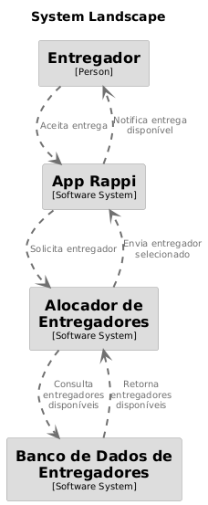<br>
  <sup>Fonte: Rappitors</sup>
</div>

### 3.3.3 Cobertura dos Testes

&emsp;&emsp;Abaixo, apresentamos os **cenários de testes** e suas respectivas etapas, seguidos pela **cobertura de testes**, detalhando quais funcionalidades são verificadas.

#### 3.3.3.1 Cenários de Testes

&emsp;&emsp;Esta tabela apresenta os principais cenários de teste do sistema, utilizando a estrutura **Given-When-Then**, que descreve o contexto inicial, a ação realizada e o resultado esperado.  

| **Cenário** | **Given** | **When** | **Then** |
|------------|----------|---------|---------|
| **Busca inicial por um entregador** | O sistema inicia a busca por um entregador disponível | - | - |
| **Entregador encontrado antes de 15 minutos** | O sistema inicia a busca por um entregador disponível | O sistema encontra um entregador antes de 15 minutos | O sistema deve alocar o entregador para a entrega |
| **Tempo de busca ultrapassa 15 minutos** | O sistema inicia a busca por um entregador disponível | O tempo de busca ultrapassa 15 minutos | O sistema não deve enviar alertas |
| **Sem entregadores próximos com pedidos finalizados** | O sistema inicia a busca por um entregador disponível | Não há entregadores próximos com pedidos quase finalizados | O sistema não deve enviar alertas |
| **Com entregadores próximos com pedidos finalizados** | O sistema inicia a busca por um entregador disponível | Há entregadores próximos com pedidos quase finalizados | O sistema deve alertar entregadores próximos com pedidos quase finalizados |
| **Todos os entregadores próximos são alertados** | O sistema inicia a busca por um entregador disponível | Há entregadores próximos com pedidos quase finalizados | O sistema deve alertar todos os entregadores próximos disponíveis |

#### 3.3.3.2 Cobertura de Testes

&emsp;&emsp;A tabela abaixo detalha quais funcionalidades do sistema são cobertas pelos testes, garantindo que os principais fluxos sejam validados corretamente.  

| **Funcionalidade Testada** | **Descrição** |
|----------------------------|--------------|
| **Início da Busca por Entregadores** | O sistema deve iniciar a busca e expandir progressivamente o raio caso nenhum entregador seja encontrado. |
| **Alocação de Entregador Dentro do Tempo Limite** | Se um entregador for encontrado antes de 15 minutos, ele deve ser alocado corretamente para a entrega. |
| **Falha na Busca por Tempo Excedido** | Se o tempo de busca ultrapassar o limite estabelecido, o sistema não deve enviar alertas. |
| **Identificação de Entregadores Próximos** | O sistema deve identificar entregadores próximos e diferenciar entre os que estão disponíveis e os que ainda estão finalizando pedidos. |
| **Notificação de Entregadores Próximos** | Se houver entregadores próximos finalizando pedidos, o sistema deve alertá-los corretamente. |
| **Ausência de Notificação Indevida** | Se não houver entregadores disponíveis, o sistema não deve gerar alertas desnecessários. |
| **Verificação de Erros e Exceções** | O sistema deve lidar corretamente com exceções e evitar falhas inesperadas. |

### 3.3.4 Conclusão

&emsp;&emsp;Além dos benefícios técnicos, a otimização do tempo de alocação dos entregadores gera um impacto social significativo. Reduzir o tempo de espera significa mais entregas em menos tempo, o que aumenta a renda dos entregadores e melhora a experiência dos consumidores. 

&emsp;&emsp;No entanto, essa otimização também pode trazer desafios. Com um ritmo mais acelerado de alocações, os entregadores podem sentir uma maior pressão para cumprir mais pedidos em menos tempo, o que pode afetar seu bem-estar e segurança no trânsito. 

&emsp;&emsp;Portanto, embora os avanços tecnológicos melhorem a eficiência e tragam benefícios claros, é essencial equilibrar essa evolução com políticas que garantam condições de trabalho justas e sustentáveis para os entregadores.

## 3.4 Otimização de Performance das Telas  

**O que é?**  
&emsp;&emsp;A lentidão em algumas telas ou etapas refere-se ao atraso no tempo de resposta do sistema durante a navegação ou ao carregar informações. Quando os usuários, sejam clientes ou entregadores, interagem com a plataforma, eles esperam uma experiência ágil. Se o tempo de carregamento for elevado, isso pode causar frustração e até mesmo abandono da plataforma.

**O que pode ser a causa?**  
- Consultas ao banco de dados não otimizadas, que demoram para retornar os dados solicitados.  
- Carregamento de recursos pesados nas páginas, como imagens e scripts grandes.  
- Infraestrutura inadequada ou servidores mal configurados.  
- Problemas de rede ou de conexão com a internet. 

**O que afeta?**  
&emsp;&emsp;Esse problema afeta diretamente a experiência do usuário, diminuindo a satisfação e a probabilidade de o usuário continuar utilizando a plataforma. Em plataformas como a Rappi, onde a agilidade é crucial, uma lentidão excessiva pode levar a uma taxa de abandono maior e impactar negativamente a percepção do serviço. Isso, por sua vez, pode resultar em uma queda nas vendas e na fidelidade dos usuários, além de aumentar a taxa de desistência durante o processo de compra ou entrega.

**Influencia do n° de requisições no desempenho do sistema**  
&emsp;&emsp;Para essa etapa da análise de qualidade do sistema da Rappi, foi criada uma tabela chamada "entregadores", no [Supabase](https://supabase.com/), que disponibiliza uma API RESTful automaticamente:
(aqui o grupo de engenheiros de software focam em comprovar a hipótese de que maiores volumes de requisições influenciam diretamente no tempo de resposta do sistema).

&emsp;&emsp;Nesta seção, ao testar no Apache JMeter, utiliza-se essa ferramenta para realizar testes de carga, desempenho e estresse em aplicações web, APIs e outros sistemas. O JMeter simula múltiplos usuários acessando o sistema simultaneamente para medir o tempo de resposta, identificar gargalos e validar a escalabilidade da aplicação.

&emsp;&emsp;O Thread Group define o número de usuários virtuais (threads) e a frequência com que as requisições serão feitas. Sendo assim, podem-se especificar os seguintes parâmetros:


Configure:
Number of Threads (Users): Número de requisições simultâneas.
Ramp-Up Period (in seconds): O tempo que o JMeter levará para iniciar todas as threads.
Loop Count: Quantas vezes cada thread realizará a requisição.


### 3.4.1 Interpretação do gráfico

   - **Linha Azul (Average)**: Representa o **tempo médio de resposta** das requisições. Neste caso, ela está aumentando de forma constante, o que indica que o sistema está ficando mais lento à medida que o número de requisições aumenta. O valor **1135 ms** é o tempo médio de resposta no final do teste.
   - **Linha Verde (Median)**: A linha verde representa o **tempo mediano** das requisições, ou seja, o tempo que divide as requisições em duas metades: 50% dos tempos de resposta são menores que a mediana e 50% são maiores. A mediana, **1073 ms**, também segue uma tendência de aumento, mas não de forma tão acentuada quanto a média. Isso indica que a maioria das requisições está se comportando de maneira mais consistente, mas ainda assim há uma piora no desempenho.
   - **Linha Vermelha (Deviation)**: A linha vermelha mostra o **desvio padrão** dos tempos de resposta. Um valor **alto de desvio** significa que há uma grande variação nos tempos de resposta das requisições. O valor de **332 ms** sugere que algumas requisições estão levando muito mais tempo para serem processadas do que outras. Isso indica que, além do tempo médio e da mediana subirem, algumas requisições estão enfrentando picos de latência.
   - **Linha Roxa (Throughput)**: A linha roxa mostra o **throughput**, ou seja, a quantidade de requisições processadas por minuto. O valor de **92.061 requisições/minuto** mostra que o sistema está processando um bom número de requisições, mas o throughput está se estabilizando, o que pode indicar que o servidor está chegando ao limite de sua capacidade de processamento.

### 3.4.2 Informações do gráfico:
   - **No of Samples (Número de amostras)**: **1243 requisições** foram feitas durante o teste.
   - **Deviation**: O desvio padrão de **332 ms** reflete uma variação significativa no tempo de resposta entre as requisições. Esse é um ponto importante para investigar, pois pode indicar gargalos ou picos de latência em algumas requisições.
   - **Latest Sample**: O tempo de resposta da última requisição foi **2400 ms**, o que é significativamente mais alto do que a média (**1135 ms**) e a mediana (**1073 ms**). Isso sugere que algumas requisições estão levando muito mais tempo para serem processadas.
   - **Average**: O **tempo médio de resposta** ao longo do teste foi **1135 ms**, o que indica uma latência considerável.
   - **Median**: O **tempo mediano de resposta** foi **1073 ms**, o que está um pouco abaixo da média e reflete que a maioria das requisições está tendo um desempenho mais consistente, mas ainda assim com um tempo de resposta elevado.

### O que isso significa?

**a. Aumento do tempo de resposta médio**:
   - O aumento contínuo do tempo de resposta médio (linha azul) ao longo do teste é um sinal claro de que o sistema está ficando sobrecarregado à medida que o número de requisições aumenta. Isso pode ser causado por uma série de fatores, como limitações de hardware, problemas na infraestrutura do servidor ou falhas no código que não estão conseguindo lidar com a carga adequadamente.

**b. Desvio elevado (linha vermelha)**:
   - O desvio alto (linha vermelha) sugere que, além do aumento no tempo médio de resposta, algumas requisições estão sendo muito mais lentas do que outras, o que pode indicar que o servidor está experimentando picos de latência ou que há algum tipo de gargalo específico em algumas partes do sistema.

**c. Throughput estabilizado**:
   - O throughput está estável (aproximadamente **92 requisições/minuto**), mas não parece estar aumentando. Isso indica que o servidor conseguiu atingir um limite de requisições por minuto, o que pode significar que a capacidade do servidor está sendo saturada.

**d. Última requisição muito mais lenta**:
   - O tempo de resposta da última requisição foi **2400 ms**, que é mais de duas vezes maior do que o tempo médio. Isso pode indicar que o servidor não está mais conseguindo processar as requisições com eficiência à medida que a carga aumenta, levando a picos de latência.

### O que fazer a partir daqui?

**a. Investigação de Gargalos**:
   - O aumento do desvio e os tempos elevados de resposta indicam que pode haver um gargalo no servidor. Vale investigar os logs do servidor e monitorar o uso de CPU, memória e outros recursos durante o teste.

**b. Ajuste de Infraestrutura**:
   - Se o sistema estiver alcançando a saturação com esse número de requisições, pode ser necessário escalar a infraestrutura. Isso pode incluir o aumento de recursos do servidor, o uso de balanceamento de carga ou a adoção de uma arquitetura distribuída.

**c. Otimização de Código e Banco de Dados**:
   - Se o servidor está atingindo sua capacidade de processamento, a otimização de partes do código (como consultas ao banco de dados ou operações de IO) pode ajudar a reduzir o tempo de resposta.

### Conexão com o Business Drivers

&emsp;&emsp;A resiliência e escalabilidade da aplicação são fundamentais para garantir uma boa experiência para os entregadores da Rappi, que dependem de respostas rápidas do sistema para aceitar pedidos e gerenciar suas entregas. Durante o teste de carga realizado com o Apache JMeter, foi possível observar que, à medida que o número de requisições simultâneas aumentava, o tempo médio de resposta também crescia progressivamente, alcançando **1135 ms**, com picos de latência que ultrapassaram **2400 ms**. Esses números têm um impacto direto no negócio, pois, em momentos de alta demanda – como horários de pico –, um tempo de resposta elevado pode dificultar a operação dos entregadores, aumentando o risco de perda de pedidos e afetando a eficiência logística da plataforma. Com um throughput estabilizado em **92.061 requisições/minuto**, o teste sugere que o sistema pode estar operando próximo ao seu limite, exigindo otimizações na infraestrutura ou no código para garantir uma melhor escalabilidade e evitar degradação no desempenho conforme o volume de entregadores conectados aumenta.

## 3.5 Eficiência na taxa de retenção dos Entregadores  

A taxa de retenção é um indicador fundamental para a Rappi, pois reflete a capacidade da empresa de manter seus entregadores ativos e engajados na plataforma. 

Se a taxa de retenção for baixa, pode ser um indício de problemas na experiência dos entregadores, como baixa remuneração, falta de suporte ou dificuldades operacionais e técnicas. Nesse cenário, a empresa pode enfrentar dificuldades para manter uma frota de entregadores suficiente para atender à demanda, principalmente em momentos de pico, o que pode levar a insatisfação dos clientes e queda nas vendas.

Por outro lado, uma alta taxa de retenção não apenas reduz os custos de recrutamento de novos entregadores, mas também contribui para a qualidade do serviço prestado.

### 3.5.1 Cenário de teste

O cenário escolhido como foco para a análise de qualidade é a taxa de retenção dos entregadores durante o período de onboarding. Esse momento reflete o espaço de tempo entre a chegada do entregador na plataforma e a adaptação completa aos processos da Rappi. 

O objetivo é garantir que uma determinada porcentagem de entregadores que iniciam o processo de cadastro na plataforma permanecem ativos até o final do período de adaptação. 

Para isso, o teste foi estruturado de forma a facilita o entendimento do código por meio da regra de negócios. 

| **Cenário** | **Given** | **When** | **Then** |
|------------|----------|---------|---------|
| **Verificar taxa de retenção de entregadores** | Um grupo de entregadores aceitou o primeiro pedido | Verificamos quantos completaram pelo menos <min_pedidos> pedidos em até <periodo> | Pelo menos <taxa_esperada>% dos entregadores devem ter atingido essa meta |

O teste verifica quantos entregadores completaram o número mínimo de pedidos dentro do período estabelecido. Para isso, é considerado o número de entregadores que aceitaram o primeiro pedido e o número desses RTs que conseguiram alcançar a meta de onboarding dentro do período estipulado. O resultado esperado é que a taxa de retenção seja igual ou superior à taxa esperada.

A nível de primeira sprint, está sendo levado em consideração uma taxa de retenção de 80% dos entregadores que iniciam o processo de onboarding, completando 20 pedidos em 2 semanas. Esses valores podem e devem sofrem ajustes conforme a análise dos dados reais do parceiro. 

# 4. Requisitos como Ativo de Software

&emsp;&emsp;Com base no trabalho desenvolvido anteriormente, a análise da qualidade do software será ampliada com a aplicação do modelo [ISO/IEC 25010](https://blog.onedaytesting.com.br/iso-iec-25010/), que define características e subcaracterísticas essenciais para a avaliação da qualidade de produtos de software. Esse modelo permitirá uma abordagem estruturada para verificar tanto requisitos funcionais quanto não funcionais, assegurando que atributos como funcionalidade, confiabilidade, desempenho e manutenibilidade sejam avaliados de maneira objetiva. Para isso, será implementado um mecanismo automatizado de validação, garantindo a conformidade contínua da solução com os critérios estabelecidos e possibilitando sua evolução de forma controlada e alinhada às necessidades do sistema.

&emsp;&emsp;A adoção do ISO/IEC 25010 permitirá uma avaliação mais abrangente e sistemática da qualidade do software, com foco na implementação e controle de requisitos funcionais (RFs) e não funcionais (RNFs). O mapa de requisitos apresentado a seguir estrutura esses critérios, assegurando que os aspectos críticos da solução sejam monitorados e atendam às especificações definidas de forma mensurável e rastreável. Dessa forma, a validação contínua dos requisitos contribuirá para a entrega de um software robusto, alinhado às boas práticas de qualidade e ao desempenho esperado pelos usuários.

## 🎯 Requisitos Funcionais (RF)  

| ID   | Nome do Requisito                 | Descrição | Critérios de Aceitação | Prioridade |
|------|----------------------------------|-----------|------------------------|------------|
| RF01 | Atribuir Pedidos a Entregadores | O sistema deve atribuir pedidos a entregadores disponíveis dentro de um raio específico da localização. | - O sistema deve identificar entregadores disponíveis no raio definido. <br> - A atribuição deve ser feita automaticamente com base na proximidade e disponibilidade. <br> - O entregador deve receber uma notificação sobre o pedido atribuído. | Alta |
| RF02 | Atualizar Localização do Entregador | O sistema deve atualizar em tempo real a localização dos entregadores para otimizar a eficiência das entregas. | - A localização deve ser atualizada periodicamente sem necessidade de ação manual. <br> - O sistema deve utilizar a localização atualizada para melhor distribuição de pedidos. <br> - Os clientes devem visualizar a posição do entregador durante a entrega. | Alta |
| RF03 | Status do Entregador | O status do entregador deve ser atualizado conforme o progresso da entrega, refletindo cada etapa da jornada do produto. | - O entregador deve poder alterar seu status manualmente (Disponível, Em entrega, Indisponível). <br> - O status deve ser atualizado automaticamente em eventos críticos, como aceitação do pedido e entrega concluída. <br> - O cliente deve visualizar o status atualizado do entregador. | Média |


## 🚀 Requisitos Não Funcionais (RNF)  

| ID   | Nome do Requisito | Descrição | Métricas de Conformidade | Prioridade |
|------|------------------|-----------|-------------------------|------------|
| RNF01 |  Desempenho e disponibilidade na exibição dos ganhos. | O sistema deve apresentar conformidade na exibição de ganhos | - O tempo médio para exibição de ganhos do entregador não pode ultrapassar **180 segundos** em horários de pico. <br> - Pelo menos **95%** das requisições devem estar dentro desse prazo. | Alta |
| RNF02 | Tolerância a falhas na exibição de dados. | O sistema deve garantir que os valores exibidos das taxas tenham uma precisão mínima de 99%. | - Os valores exibidos devem ter uma margem de erro inferior a **1%**. <br> - Os cálculos devem ser consistentes entre o frontend e backend. | Alta |
| RNF03 | Tempo de Resposta para Exibição das Taxas | O tempo de resposta para exibição das taxas não deve ultrapassar 1 segundo em condições normais de operação. | - 95% das requisições de exibição de taxas devem ser processadas em **≤1 segundo**. | Média |
| RNF04 | Tempo de Exibição dos Ganhos | A interface do usuário deve exibir os ganhos em menos de 2 segundos em 95% das requisições. | - 95% das requisições de exibição de ganhos devem ser processadas em **≤2 segundos**. | Alta |
| RNF05 | Cache de Últimos Ganhos Conhecidos | Deve haver um mecanismo de cache para fornecer os últimos ganhos conhecidos quando a API estiver indisponível. | - O cache deve armazenar os últimos ganhos conhecidos por pelo menos **24 horas**. <br> - A interface deve exibir os ganhos do cache caso a API não responda em **5 segundos**. | Média |
| RNF06 | Tempo de Resposta Geral | 97% das requisições devem ser processadas em menos de 3 segundos. | - 97% das requisições HTTP devem ter um tempo de resposta **≤3 segundos**. | Alta |

&emsp;&emsp;Além da definição dos requisitos, foi implementada uma estrutura de aferição automatizada, garantindo que tanto os RFs quanto os RNFs sejam continuamente avaliados. Esse mecanismo possibilitará a verificação objetiva da conformidade com os critérios estabelecidos, fortalecendo a confiabilidade do sistema e promovendo uma evolução controlada da solução, alinhada às necessidades identificadas.

| Característica da ISO | Atributo de Qualidade | Overview da Codificação |
|----------------------|----------------------|----------------------------------|
| Desempenho e Eficiência | Tempo de Resposta | Os requisitos **RNF03, RNF04 e RNF06** garantem que as requisições do sistema sejam processadas dentro de um tempo aceitável, evitando atrasos na exibição de informações críticas como taxas e ganhos. |
| Confiabilidade | Tolerância a Falhas | O requisito **RNF05** implementa um mecanismo de cache para exibir os últimos ganhos conhecidos caso a API fique indisponível, garantindo continuidade no acesso à informação. |
| Confiabilidade | Disponibilidade | O requisito **RNF01** estabelece um tempo máximo de 3 minutos para encontrar um entregador, mesmo em horários de pico, evitando indisponibilidade do serviço. |
| Precisão | Exatidão dos Cálculos | O requisito **RNF02** assegura que os valores das taxas tenham uma precisão mínima de 99%, garantindo cálculos confiáveis entre frontend e backend. |
| Usabilidade | Facilidade de Uso | Os requisitos **RF02 e RF03** garantem que a interface do usuário mostre corretamente a localização dos entregadores e seu status atualizado em tempo real. |
| Funcionalidade | Correção Funcional | O requisito **RF01** garante que os pedidos sejam atribuídos automaticamente aos entregadores disponíveis dentro de um raio específico, evitando falhas na distribuição dos pedidos. |
| Eficiência | Escalabilidade | O requisito **RNF06** exige que 97% das requisições sejam processadas em menos de 3 segundos, garantindo que o sistema suporte aumento na demanda sem perda significativa de desempenho. |

## 4.1 Requisitos Funcionais (RF)

Para conseguir averiguar localmente os requisitos funcionais desenvolvidos, o grupo de desenvolvedores aconselha seguir os seguintes passos (obs: o [python](https://www.python.org/downloads/) deverá estar instalado):

1. Entrar na Api centralizada do projeto
```
cd src/rappitors_api
```

2. Criar um ambiente virtual
```
python venv venv.
```

3. Ativar o ambiente virtual
```
.\venv\Scripts\activate   
```

4. Instalar as dependências
```
pip install -r .\requirements.txt
```

5. Agora é só rodar a api
```
uvicorn routes:app --reload
```

6. A documentação como código estará disponivel em: http://127.0.0.1:8000/docs

<div align="center">
  <sub>Figura 2: Rappitors API</sub><br>
  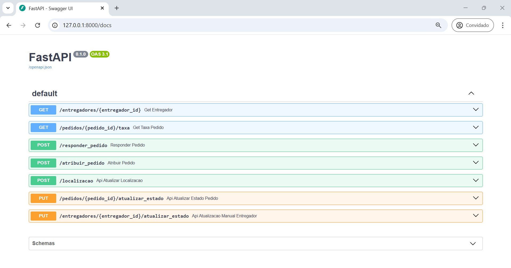<br>
  <sup>Fonte: Rappitors</sup>
</div>


### RF1: Atribuir Pedidos a Entregadores

&emsp;&emsp;Para garantir uma entrega rápida em horários de pico, o sistema deve atribuir pedidos a entregadores disponíveis em uma determinada área. Esse processo envolve a verificação da proximidade e da prioridade dos entregadores, garantindo que aqueles com melhor desempenho tenham preferência. A lógica de atribuição considera a localização do pedido e a disponibilidade dos entregadores, ajustando dinamicamente o raio de busca conforme necessário.

- Objetivo: Atribuir um pedido a entregadores disponíveis dentro de um raio específico da localização.
- Rota: `POST /atribuir_pedido`
- Entrada:
  - `pedido_id`: Identificador único do pedido.
  - `latitude`: Latitude da localização do pedido.
  - `longitude`: Longitude da localização do pedido.
- Processo:
  1. O sistema verifica os entregadores disponíveis e próximos (dentro de um raio inicial de 500 metros).
  2. Os entregadores são ordenados por saldo (quanto maior o saldo, maior a prioridade).
  3. Se não houver entregadores dentro do raio, o sistema expande a busca em incrementos de 500 metros até encontrar candidatos.
  4. O pedido é atribuído aos 3 entregadores mais próximos e com maior saldo.

 **Resposta**
```json
{
  "message": "Entregadores atribuídos ao pedido",
  "pedido_id": 1,
  "candidatos": [
    1,
    10,
    2,
    3,
    5,
    6,
    8
  ]
}
```
 **Exemplo de Requisição**
```json
{
  "pedido_id": "1",
  "latitude": -23.5631,
  "longitude": -46.6565
}
```

<div align="center">
  <sub>Figura 3: POST/atribuir_pedido Requisição</sub><br>
  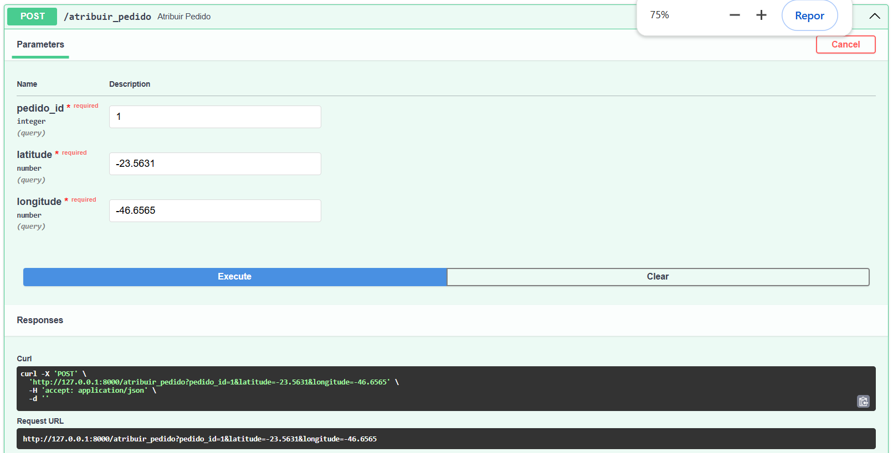<br>
  <sup>Fonte: Rappitors</sup>
</div>

<div align="center">
  <sub>Figura 4: POST/atribuir_pedido Resposta</sub><br>
  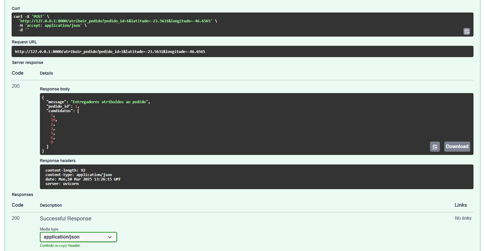<br>
  <sup>Fonte: Rappitors</sup>
</div>

### RF2: Atualizar Localização do Entregador

&emsp;&emsp;Para otimizar a eficiência das entregas e melhorar a experiência dos usuários, é essencial que a localização dos entregadores seja atualizada em tempo real. Isso permite ao sistema atribuir pedidos com mais precisão, acompanhar o deslocamento dos entregadores e oferecer estimativas mais confiáveis para os clientes. A atualização contínua da posição do entregador garante uma melhor alocação de pedidos e reduz o tempo de espera.

- Objetivo: Permitir que o entregador atualize sua localização em tempo real.
- Rota: `POST /localizacao`
- Entrada:
  - `entregador_id`: Identificador único do entregador.
  - `latitude`: Latitude atual do entregador.
  - `longitude`: Longitude atual do entregador.
- Processo:
  1. O sistema recebe a nova localização do entregador e atualiza o banco de dados.

**Resposta**
```json
{
  "message": "Localização atualizada"
}
```

**Exemplo de Requisição**
```json
{
  "entregador_id": "1",
  "latitude": -23.557134294219296,
  "longitude": -46.74533878617023
}
```

> obs: para esse exemplo, foram utilizadas as coordenadas do estabelecimento [McDonald's](https://www.google.com.br/maps/place/McDonald's/@-23.5589761,-46.7519839,15z/data=!4m10!1m2!2m1!1sMcDonald's!3m6!1s0x94ce5606329309a7:0x92bae9a897175317!8m2!3d-23.557536!4d-46.7452883!15sCgpNY0RvbmFsZCdzIgOIAQFaDCIKbWNkb25hbGQnc5IBFGZhc3RfZm9vZF9yZXN0YXVyYW504AEA!16s%2Fg%2F1ts30d3h?entry=ttu&g_ep=EgoyMDI1MDMwNC4wIKXMDSoASAFQAw%3D%3D)

<div align="center">
  <sub>Figura 5: POST/localizacao Requisição</sub><br>
  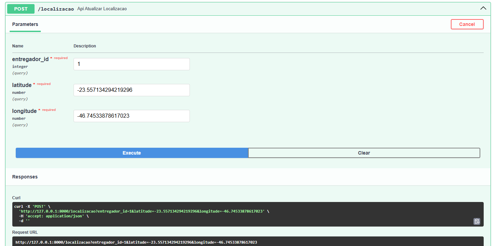<br>
  <sup>Fonte: Rappitors</sup>
</div>

<div align="center">
  <sub>Figura 6: POST/localizacao Resposta</sub><br>
  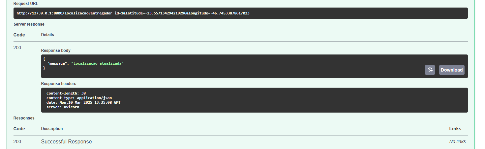<br>
  <sup>Fonte: Rappitors</sup>
</div>

<div align="center">
  <sub>Figura 7: Mudança na base</sub><br>
  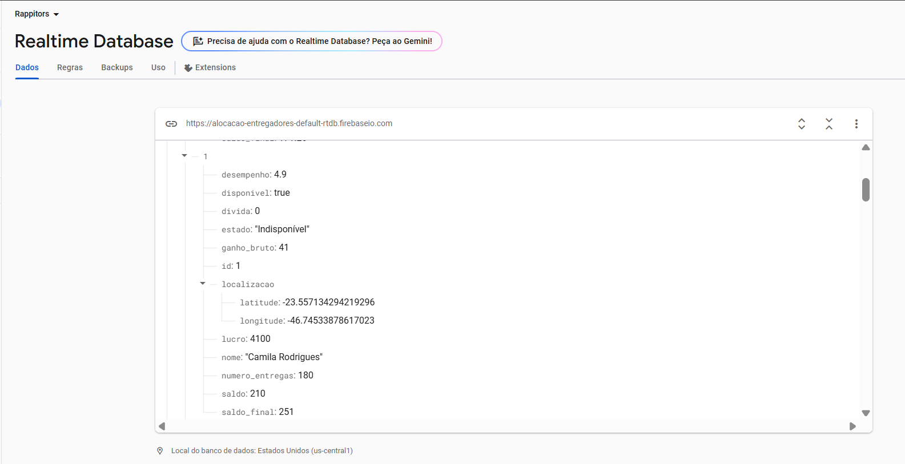<br>
  <sup>Fonte: Rappitors</sup>
</div>

### RF3: Alteração eficiente de estado do entregador

&emsp;&emsp;Para garantir a eficiência na troca dos estados dos entregadores, é essencial que o sistema leve em consideração o status do pedido. A mudança de estado deve refletir a situação real do entregador, permitindo que o sistema tome decisões com base nessa informação.

Para isso, foram considerados as seguintes relações entre troca de estado do entregador com o status do pedido:

| **Estado do Entregador** | **Status do Pedido** | **Descrição** |
|--------------------------|----------------------|--------------|
| 1. Disponível | Pendente | O entregador está disponível para novos pedidos. |
| 2. A caminho da loja | Preparando | O entregador está a caminho do local de entrega. |
| 3. Aguardando pedido | Preparando | O entregador está aguardando a preparação do pedido. |
| 4. Pedido coletado | Pronto | O entregador coletou o pedido na loja e em breve sairá para entregar. |
| 5. A caminho | A caminho | O entregador está a caminho do cliente. |
| 6. Pedido entregue | Entregue | O entregador entregou o pedido com sucesso. |
| 7. Indisponível | N/A | O entregador está temporariamente indisponível. |
| 8. Disponível | Cancelado | O entregador está disponível para novos pedidos após um cancelamento |

Os estados 3 e 7 são alterados de maneira manual pelo entregador, enquanto os demais são atualizados automaticamente com base no status do pedido. Essa abordagem garante que o sistema reflita com precisão a situação do entregador e do pedido, permitindo uma melhor alocação e acompanhamento das entregas.

Para implementá-la, foram criadas rotas para a atualização automática e manual do estado do entregador, conforme descrito a seguir.

- Rotas: 
   - Atualização automática: `PUT /pedidos/{pedido_id}/atualizar_estado`
   - Atualização manual: `PUT /entregadores/{entregador_id}/atualizar_estado`
   <br>
- Entrada:
  - `estado`: Novo estado(int).
  <br>
- Processo:
   1. O sistema verifica o estado atual do pedido e atualiza o estado do entregador de acordo.
   2. Se o estado do pedido for "Preparando", o estado do entregador será alterado para "A caminho da loja".
   3. Se o entregador chegar na loja, ele pode alterar manualmente seu estado para "Aguardando pedido".
   4. Após o preparo do pedido, o estado do entregador é alterado para "Pedido coletado".
   5. Durante a entrega, o estado do entregador muda para "A caminho".
   6. Após a entrega, o estado é atualizado para "Pedido entregue" e, posteriormente, "Disponível".
   7. Caso o pedido seja cancelado, o estado do entregador é alterado para "Disponível".
   8. O entregador pode optar por ficar "Indisponível" temporariamente.
   <br>

**Resposta**
```json
{
  "message": "Estado do pedido atualizado"
}
```

**Exemplo de Requisição**
```json
{
  "pedido_id": "4",
  "estado": "Preparando"
}
```

<div align="center">
  <sub>Figura 8: Requisição para alterar estado do pedido</sub><br>
  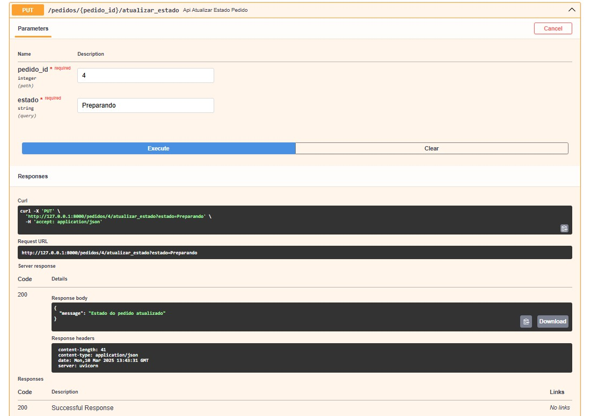<br>
  <sup>Fonte: Rappitors</sup>
</div>

<div align="center">
  <sub>Figura 9: Requisição para alterar estado do entregador</sub><br>
  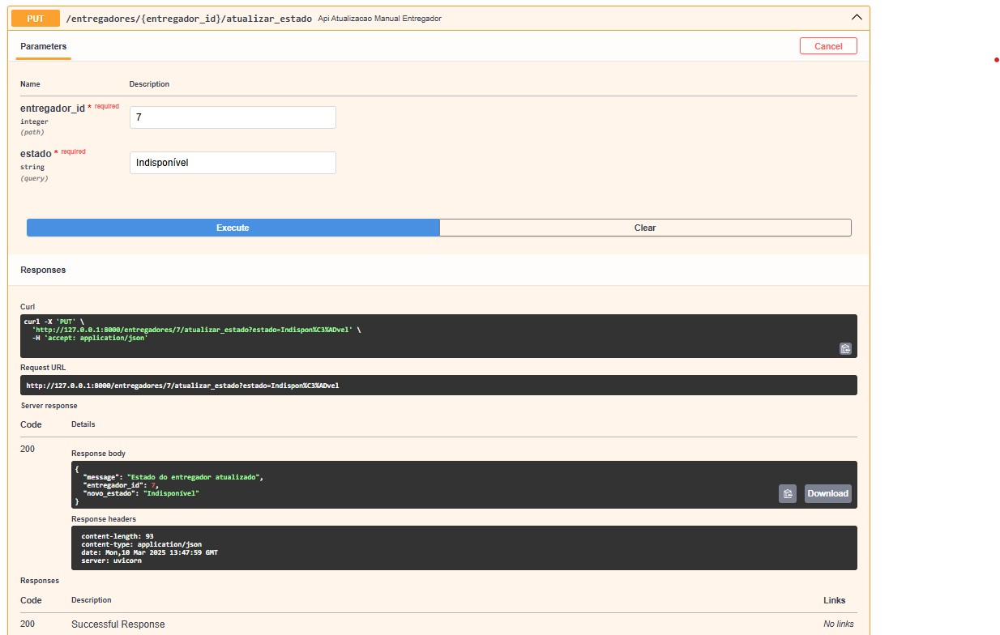<br>
  <sup>Fonte: Rappitors</sup>
</div>

> obs: outras rotas disponíveis em 
src>rappitors_api>routes

## 4.2 Requisitos Não Funcionais (RNF)

### 4.2.1 Aferição de ganhos dos entregadores (RNF04 e RNF05) 

Esta seção descreve a execução dos testes relacionados aos requisitos não funcionais (RNFs) que garantem a **disponibilidade** e **tolerância a falhas** (Tempo de Exibição dos Ganhos / Cache de Últimos Ganhos Conhecidos) no sistema de exibição de ganhos dos entregadores. Os testes foram realizados utilizando a ferramenta de automação **Behave**, com foco na validação de dois aspectos principais: o desempenho da API e a tolerância a falhas no sistema de exibição. Além disso, foi implementado um cache utilizando **Redis** para garantir a disponibilidade dos dados em caso de falhas na API.


### **Implementação do Cache com Redis**

> obs: aqui foi criada uma api secundária, com somente uma rota. Isso se explica ao realizar um recorte sobre o requisito não funcional que utliliza de cache.

1. Entrar na Api secundaria
```
cd src/system_performance/cache-service
```

2. Criar um ambiente virtual
```
python venv venv.
```

3. Ativar o ambiente virtual
```
.\venv\Scripts\activate   
```

4. Instalar as dependências
```
pip install -r .\requirements.txt
```

5. Agora é só rodar a api
```
uvicorn cache:app --reload
```

6. A documentação como código estará disponivel em: http://127.0.0.1:8000/docs

<div align="center">
  <sub>Figura 10: Cache API</sub><br>
  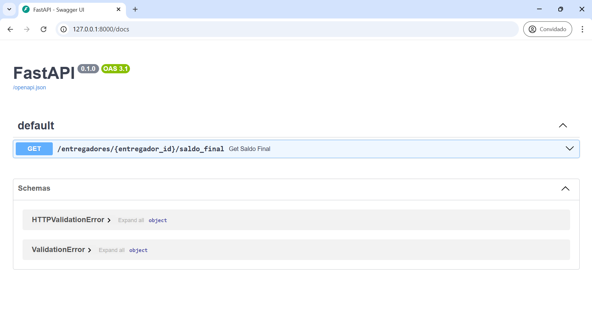<br>
  <sup>Fonte: Rappitors</sup>
</div>

Um dos requisitos importantes para garantir a alta disponibilidade da exibição dos ganhos foi a implementação de um **cache com Redis**. O objetivo do cache é fornecer os últimos valores conhecidos de saldo e ganho bruto dos entregadores, permitindo que a interface do usuário (UI) mostre os dados mesmo quando a API não estiver disponível.

Redis é um banco de dados NoSQL em memória, extremamente rápido e eficiente, que armazena dados no formato **chave-valor**. Ele é amplamente utilizado para **cache**, **armazenamento de sessões**, **filas de mensagens** e **controle de requisições**, reduzindo a carga em bancos tradicionais e melhorando o desempenho de aplicações. Diferente de bancos relacionais, Redis mantém os dados na RAM, permitindo leituras e escritas quase instantâneas, mas também oferece opções de **persistência** para garantir que as informações não sejam perdidas. Sua escalabilidade e suporte a replicação fazem dele uma escolha ideal para sistemas de alto desempenho e aplicações que exigem respostas em tempo real.

Contudo, o Redis não tem suporte nativo oficial para Windows. Ele foi projetado para rodar em Linux e macOS, pois usa mecanismos avançados de gerenciamento de memória e processos que não existem no Windows. Por isso o grupo de desenvolvedores indica utilizar uma versão extraoficial neste caso específico de teste de cache:

1. Baixar o Redis para Windows

Neste [link](https://drive.google.com/file/d/1QhlKyEU9MzP6q5mstYMjmuDhEHyaMigW/view?usp=sharing), baixe o arquivo .zip (Redis-x64-3.0.504.zip)

2. Extrair e Configurar o Redis

Extraia o conteúdo do .zip para uma pasta (por exemplo, C:\Redis).
Dentro da pasta extraída, você o arquivo ```redis-server```, você deverá clicar duas vezes para abri-lo.

3.  Teste para ver se o Redis esta funcionando

Abra o arquivo ```redis-cli``` e escreva "PING", caso a resposta seja "PONG", o redis esta funcionando corretamente.

<div align="center">
  <sub>Figura 11: Funcionamento do Redis</sub><br>
  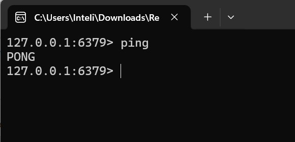<br>
  <sup>Fonte: Rappitors</sup>
</div>

A implementação do cache foi realizada utilizando a biblioteca **redis.asyncio**, permitindo interação assíncrona com o Redis. A seguir, detalhamos o funcionamento básico do cache:

1. **Conexão com Redis**: A função `get_redis_connection()` estabelece a conexão assíncrona com o Redis.
2. **Armazenamento de Dados no Cache**: O saldo e o ganho bruto de cada entregador são armazenados no Redis, com as chaves `saldo:{entregador_id}` e `ganho_bruto:{entregador_id}`.
3. **Recuperação de Dados do Cache**: Ao solicitar os dados de um entregador, o sistema verifica o cache. Se os dados estiverem disponíveis, são utilizados para calcular o saldo final, exibido na UI.

<div align="center">
  <sub>Figura 12: Res</sub><br>
  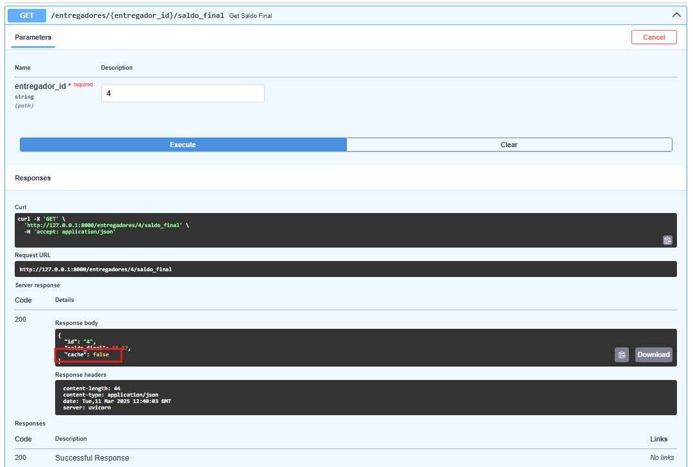<br>
  <sup>Fonte: Rappitors</sup>
</div>

### **Execução dos Testes**

Os testes realizados para garantir que os requisitos não funcionais sejam atendidos focaram no desempenho e na tolerância a falhas. Abaixo estão os detalhes de cada cenário de teste, seus resultados e a validação dos requisitos.

#### **RNF01: Desempenho e Disponibilidade na Exibição de Ganhos**

| **Cenário**                         | **Descrição**                                                                                     | **Resultado**                                                                                                                                                       |
|-------------------------------------|-------------------------------------------------------------------------------------------------|--------------------------------------------------------------------------------------------------------------------------------------------------------------------|
| **Cenário 1: Resposta em Menos de 2 Segundos**    | Testa se a resposta da API é retornada em menos de 2 segundos.                                   | **Passou**: A resposta foi simulada com um tempo de 1,5 segundos, atendendo ao requisito de desempenho.                                                           |
| **Cenário 2: API Indisponível**              | Testa se a UI exibe uma mensagem informativa quando a API está indisponível.                   | **Passou**: A UI exibiu corretamente a mensagem "Dados temporariamente indisponíveis".                                                                             |
| **Cenário 3: Uso do Cache**                | Testa se, quando a API está indisponível, a UI exibe o último saldo conhecido recuperado do cache. | **Passou**: A UI utilizou os dados armazenados no Redis para exibir o saldo final correto.                                                                        |

#### **RNF02: Tolerância a Falhas na Exibição de Ganhos**

| **Cenário**                                       | **Descrição**                                                                                                   | **Resultado**                                                                                                                                                       |
|-------------------------------------------------|-----------------------------------------------------------------------------------------------------------------|--------------------------------------------------------------------------------------------------------------------------------------------------------------------|
| **Cenário 4: Backoff Exponencial em Caso de Falha** | Testa a retentativa com backoff exponencial quando a API de ganhos está instável.                                | **Passou**: O sistema realizou as retentativas com aumento progressivo do intervalo de tempo entre elas.                                                            |
| **Cenário 5: Exibição de Ganhos após Retentativa**  | Testa se o sistema exibe os ganhos corretamente após a tentativa ser bem-sucedida após falhas iniciais.           | **Passou**: Após as falhas iniciais e a retentativa bem-sucedida, o saldo final foi exibido corretamente.                                                           |

### **Detalhamento dos Cenários de Teste**

#### **Cenário 1: Resposta da API em Menos de 2 Segundos**

- **Objetivo**: Verificar se a resposta da API de ganhos é retornada em menos de 2 segundos.
- **Implementação**:
  - Dado que a API de ganhos está disponível.
  - Quando a requisição é realizada e a resposta é recebida.
  - Então, a resposta deve ser retornada em menos de 2 segundos.
- **Resultado Esperado**: O tempo de resposta foi simulado para ser de 1,5 segundos, o que está dentro do limite estabelecido de 2 segundos.
  
| **Teste**                | **Resultado**                      |
|--------------------------|------------------------------------|
| Tempo de resposta da API | **Aprovado** (menor que 2 segundos) |

#### **Cenário 2: Exibição de Mensagem Informativa Quando a API Não Responde**

- **Objetivo**: Verificar se a UI exibe uma mensagem informativa quando a API não responde.
- **Implementação**:
  - Dado que a API de ganhos está indisponível.
  - Quando a UI solicita os dados dos ganhos.
  - Então, a UI deve exibir uma mensagem como "Dados temporariamente indisponíveis".
  
| **Teste**                          | **Resultado**                                  |
|------------------------------------|----------------------------------------------|
| Exibição de mensagem quando API falha | **Aprovado** ("Dados temporariamente indisponíveis") |

#### **Cenário 3: Exibição de Último Saldo Conhecido com Cache**

- **Objetivo**: Verificar se, em caso de falha na API, o sistema utiliza o cache para exibir os últimos dados de saldo e ganho bruto.
- **Implementação**:
  - Dado que o cache contém os últimos ganhos do entregador.
  - Quando a API está indisponível e a UI solicita os ganhos do entregador.
  - Então, a UI deve exibir o saldo final a partir do cache.
  
| **Teste**                     | **Resultado**                    |
|-------------------------------|----------------------------------|
| Exibição de dados a partir do cache | **Aprovado** (último saldo conhecido) |

#### **Cenário 4: Retentativa com Backoff Exponencial em Caso de Falha**

- **Objetivo**: Verificar se o sistema tenta novamente com backoff exponencial após falha de requisição à API.
- **Implementação**:
  - Dado que a API de ganhos está instável.
  - Quando uma requisição à API falha.
  - Então, o sistema deve tentar novamente com backoff exponencial.
  
| **Teste**                        | **Resultado**                    |
|----------------------------------|----------------------------------|
| Tentativa com backoff exponencial | **Aprovado** (retentativas realizadas) |

#### **Cenário 5: Exibição de Saldo Final após Retentativa Bem-Sucedida**

- **Objetivo**: Verificar se, após uma tentativa bem-sucedida de requisição à API, o saldo final é exibido corretamente.
- **Implementação**:
  - Dado que o sistema tentou a requisição várias vezes.
  - Quando a API se recupera e responde com sucesso.
  - Então, o saldo final exibido deve ser o valor correto calculado.
  
| **Teste**                         | **Resultado**                     |
|-----------------------------------|-----------------------------------|
| Exibição de saldo final após sucesso | **Aprovado** (saldo exibido corretamente) |


Os testes realizados abordaram com sucesso os principais requisitos não funcionais relacionados à exibição dos ganhos dos entregadores. O desempenho da API foi validado com o tempo de resposta, e a tolerância a falhas foi garantida através do uso do cache com Redis e da implementação de retentativas com backoff exponencial.

Embora os testes tenham sido bem-sucedidos, a implementação de monitoramento da API e a validação da tolerância de erro entre o valor exibido e o calculado ainda precisam ser validadas em testes futuros para garantir uma cobertura completa de todos os requisitos não funcionais.

### **Tabela Resumo dos Resultados**

| **RNF** | **Requisito**                                                     | **Resultado** |
|---------|-------------------------------------------------------------------|---------------|
| **RNF01** | Resposta da API em menos de 2 segundos                            | **Aprovado**  |
| **RNF02** | Exibição de mensagem informativa em falha da API                  | **Aprovado**  |
| **RNF02** | Exibição de saldo a partir do cache                               | **Aprovado**  |
| **RNF02** | Retentativa com backoff exponencial                               | **Aprovado**  |
| **RNF02** | Exibição de saldo após retentativa bem-sucedida                   | **Aprovado**  |

### 4.2.2 Precisão e Tempo de Resposta na Exibição das Taxas (RNF02 e RNF03)

#### RNF02 - Precisão dos Valores de Taxas

O sistema deve garantir que os valores exibidos tenham uma precisão mínima de **99%**, ou seja, a margem de erro deve ser inferior a **1%**. Isso significa que cálculos inconsistentes entre o frontend e o backend precisam ser evitados, garantindo que os valores sejam sempre coerentes e confiáveis.

#### RNF03 - Tempo de Resposta para Exibição das Taxas
A consulta e exibição das taxas devem ser rápidas. Pelo menos **95% das requisições** precisam ser respondidas em **até 1 segundo** durante condições normais de operação. Isso garante uma experiência fluida para o usuário, evitando atrasos perceptíveis na interface.

Para atingir esses requisitos, o código precisa seguir algumas boas práticas. O repositório de pedidos busca a taxa associada a um pedido no banco de dados. No endpoint que retorna a taxa, a medição do tempo de resposta permite identificar atrasos. Se o tempo exceder **0,1s**, um alerta é gerado para monitoramento.

Dessa forma, ao combinar **precisão nos cálculos** com **otimização no tempo de resposta**, o sistema garante confiabilidade e eficiência na exibição das taxas.

<div align="center">
  <sub>Figura 13: Res</sub><br>
  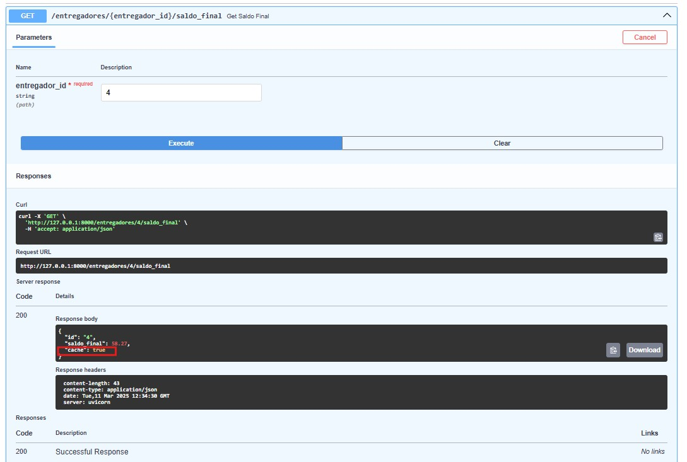<br>
  <sup>Fonte: Rappitors</sup>
</div>

### 4.2.3 Robustez e Resiliência do Sistema (RNF06) 

&emsp;&emsp;Com base na dor identificada "Lentidão no Sistema", foi estabelecido o requisito de que 97% das requisições devem ser processadas em menos de 3 segundos. Esse critério visa melhorar a performance das telas, garantindo uma experiência mais fluida para os usuários e reduzindo a taxa de abandono da plataforma.

&emsp;&emsp;Diante desse desafio, a equipe de engenharia de software propôs uma abordagem focada na Robustez e Resiliência do Sistema (RNF04), explorando a oportunidade de avaliar e otimizar o desempenho do sistema do parceiro de maneira dinâmica e escalável.

&emsp;&emsp;Para isso, será implementada uma lógica de monitoramento e escalabilidade automática que acompanha o tempo de resposta das requisições no servidor. Caso o tempo médio dobre em relação ao estado normal, um novo servidor será iniciado automaticamente para redistribuir as requisições, reduzindo a sobrecarga e mantendo o desempenho dentro dos limites estabelecidos. O mecanismo garantirá que a ativação de um novo servidor ocorra em até 30 segundos, assegurando a continuidade da operação sem degradação significativa.

&emsp;&emsp;Essa abordagem será validada com testes de carga e stress, garantindo que o sistema atenda aos critérios de qualidade definidos conforme a norma ISO/IEC 25010, contemplando atributos como Desempenho, Eficiência, Confiabilidade e Tolerância a Falhas.

## Atributos de Qualidade e Aplicação ao Sistema  

| **Conjunto de Características** | **Atributo de Qualidade** | **Descrição** | **Aplicação à Escalabilidade Automática** |
|---------------------------------|-------------------------|--------------|------------------------------------------|
| **Desempenho e Eficiência** | **Capacidade de Resposta (Time Behavior)** | Mede a rapidez com que o sistema responde às requisições. | A lógica monitora o tempo médio de resposta e aciona novos servidores quando a latência dobra. |
| **Desempenho e Eficiência** | **Utilização de Recursos (Resource Utilization)** | Garante que o sistema utilize recursos de maneira eficiente, sem desperdício ou sobrecarga. | Apenas quando necessário, novos servidores são iniciados para balancear a carga, evitando consumo excessivo de infraestrutura. |
| **Confiabilidade** | **Disponibilidade (Availability)** | Mede o tempo em que o sistema está disponível e operacional para os usuários. | A ativação dinâmica de servidores reduz a chance de downtime e mantém o serviço acessível. |
| **Confiabilidade** | **Tolerância a Falhas (Fault Tolerance)** | Capacidade do sistema de continuar operando mesmo diante de falhas ou degradação. | O monitoramento identifica picos de latência e previne colapsos ao distribuir a carga antes que ocorram falhas críticas. |
| **Capacidade de Manutenção** | **Modificabilidade (Modifiability)** | Facilidade para modificar o sistema sem afetar sua estabilidade. | A solução permite ajustar limites e estratégias de escalabilidade sem necessidade de grandes reestruturações. |
| **Segurança** | **Gestão de Recursos (Resource Protection)** | Evita que o sistema seja sobrecarregado por requisições maliciosas ou não planejadas. | A lógica impede que um único servidor seja sobrecarregado, garantindo proteção contra ataques de negação de serviço (DDoS). |

### A. Monitoramento e Ajustes Dinâmicos de Escalabilidade

&emsp;&emsp;Para garantir que a solução de escalabilidade automática opere de maneira eficiente e atenda aos requisitos de tempo de resposta, um mecanismo contínuo de monitoramento será implementado. Esse mecanismo terá como função principal coletar métricas de desempenho em tempo real e tomar decisões dinâmicas de escalabilidade com base em dados concretos.

&emsp;&emsp;A estrutura de monitoramento funcionará da seguinte forma:
- **Coleta de Métricas:** O tempo de resposta médio das requisições será monitorado através dos logs de execução armazenados no Firebase Realtime Database.
- **Definição de Limiares:** Um limiar de latência será estabelecido para identificar quando a performance do sistema degrada.
- **Tomada de Decisão:** Caso o tempo de resposta ultrapasse o limiar definido, um novo servidor será instanciado automaticamente.
- **Desativação de Servidores:** Quando a demanda diminuir e os tempos de resposta voltarem aos níveis normais, instâncias excedentes serão desligadas para evitar desperdício de recursos.

&emsp;&emsp;A lógica de escalabilidade implementada utilizará um balanceador de carga para distribuir as requisições entre os servidores ativos. Esse balanceamento ocorrerá de forma automática e transparente para os usuários, garantindo a continuidade da operação sem impacto perceptível.

### B. Componentes do Sistema e Lógica de Funcionamento

O sistema de escalabilidade dinâmica é composto por três serviços principais: `api-service`, `monitor-service` e `scaling-service`. Cada um deles desempenha um papel essencial para garantir a performance, resiliência e escalabilidade da aplicação.

#### **1. API-Service**

&emsp;&emsp;O `api-service` é o componente responsável por processar requisições dos usuários. Ele é implementado utilizando FastAPI e suporta múltiplas instâncias para atender a uma carga variável. O serviço responde às requisições HTTP e está sujeito ao balanceamento de carga automático para distribuir as demandas de forma eficiente.

- Cada instância roda na porta **8000** por padrão, mas portas adicionais são alocadas dinamicamente conforme a necessidade de escalonamento.
- O tempo de resposta das requisições é registrado em um banco Firebase para posterior análise pelo `monitor-service`.
- Quando a carga aumenta e novas instâncias são criadas, o `nginx-proxy` automaticamente redireciona as requisições para os novos servidores disponíveis.

#### **2. Monitor-Service**

&emsp;&emsp;O `monitor-service` é responsável por realizar testes de carga contínuos na API para avaliar sua capacidade de resposta. Ele utiliza **Locust**, uma ferramenta especializada em simulação de tráfego, para verificar a latência das requisições e identificar momentos de sobrecarga.

A lógica do `monitor-service` funciona da seguinte maneira:
- Ele dispara múltiplas requisições para a API, simulando acessos de usuários reais.
- Mede o tempo de resposta e armazena os dados no Firebase.
- Caso a latência ultrapasse um limiar predefinido, ele dispara um alerta para o `scaling-service`.
- Os logs gerados ajudam a calibrar os parâmetros de escalabilidade e prever momentos de alta demanda.

#### **3. Scaling-Service**

&emsp;&emsp;O `scaling-service` é o componente responsável por aumentar ou reduzir dinamicamente a quantidade de servidores disponíveis com base nas métricas do `monitor-service`.

A lógica de funcionamento do `scaling-service` é:
- Ele monitora continuamente o tempo médio de resposta registrado no Firebase.
- Se a latência média ultrapassar um limite predefinido (por exemplo, **o dobro do tempo normal**), uma nova instância do `api-service` é criada automaticamente.
- Para evitar conflitos, cada nova instância recebe um nome único (`api-service-2`, `api-service-3`, etc.) e uma porta diferente.
- Quando a demanda diminui, ele encerra servidores desnecessários para economizar recursos.

&emsp;&emsp;A criação das novas instâncias ocorre automaticamente através do **Docker** (quando local, em outros contextos de cloud isso se aplica em máquinas virtuais), assim, novo container baseado na imagem do `api-service`, mapeando uma nova porta e garantindo que a API continue atendendo sem interrupções.


### C. Validação e Testes de Carga

&emsp;&emsp;Para assegurar que a estratégia de escalabilidade dinâmica seja eficaz e atenda aos requisitos estabelecidos, um conjunto de testes de carga e estresse será conduzido. Esses testes terão como objetivo validar a robustez do sistema em diferentes cenários de uso, simulando variações na demanda e identificando possíveis gargalos de desempenho.

Os testes serão divididos em três fases principais:

#### **1. Testes de Carga Normal**
- Simulação de um volume regular de requisições para validar o tempo médio de resposta em condições normais.
- Monitoramento do consumo de recursos em um cenário sem escalonamento.
- Comparação com a métrica de 97% das requisições processadas em até 3 segundos.

#### **2. Testes de Sobrecarga Controlada**
- Aumento gradual no volume de requisições para avaliar a capacidade do sistema de escalar automaticamente.
- Verificação da ativação dinâmica de novas instâncias e a eficácia do balanceamento de carga.
- Análise da latência antes e depois da ativação dos novos servidores.

#### **3. Testes de Estresse**
- Simulação de picos abruptos de tráfego para validar o comportamento do sistema em cenários extremos.
- Identificação de possíveis gargalos ou limitações do modelo de escalabilidade.
- Medição do tempo de ativação e resposta do sistema sob carga intensa.

Os testes serão conduzidos utilizando **Locust**, uma ferramenta de código aberto para testes de carga distribuída, que permitirá a simulação de usuários concorrentes interagindo com o sistema de forma programada. Os resultados serão documentados e analisados para ajustes contínuos na estratégia de escalabilidade.


### D. Aderência às Normas de Qualidade e Resiliência

| **Conjunto de Características** | **Atributo de Qualidade** | **Descrição** | **Aplicação à Escalabilidade Automática** |
|---------------------------------|-------------------------|--------------|------------------------------------------|
| **Eficiência** | **Escalabilidade (Scalability)** | Capacidade do sistema de aumentar ou reduzir recursos automaticamente conforme a demanda. | Novos servidores são ativados quando a latência ultrapassa o limiar crítico, garantindo eficiência operacional. |
| **Confiabilidade** | **Recuperação de Falhas (Recovery Time Objective - RTO)** | Mede o tempo necessário para restaurar a performance após um incidente. | A estratégia de escalonamento prevê a ativação de novos servidores em menos de 30 segundos. |
| **Manutenção** | **Flexibilidade (Flexibility)** | Facilidade para modificar e otimizar os limites de escalabilidade sem impacto na operação. | Permite ajustes dinâmicos nas políticas de escalabilidade sem necessidade de downtime. |
| **Segurança** | **Proteção contra Sobrecarga (Overload Protection)** | Garante que o sistema não sofra impactos de acessos excessivos inesperados. | O balanceador de carga distribui requisições entre servidores ativos, evitando sobrecarga de um único nó. |

### 4.2.4 Encontrar um Entregador Disponível em no Máximo 3 Minutos (RNF01)

&emsp;&emsp;Para garantir um serviço ágil e eficiente, o sistema deve ser capaz de encontrar um entregador disponível dentro de um tempo máximo de **3 minutos**. Esse tempo limite é essencial para evitar longas esperas por parte dos clientes e manter a fluidez das operações logísticas. O processo de busca é dinâmico e adapta-se conforme a disponibilidade dos entregadores, ampliando progressivamente o raio de busca até que um entregador seja encontrado ou o tempo limite seja atingido.

- **Objetivo**: Garantir que o sistema consiga encontrar um entregador disponível no máximo **em 3 minutos** de busca.
- **Descrição**:
  - O sistema deve buscar entregadores em tempo real com o menor tempo de resposta possível. Se a busca inicial (com raio de 500 metros) não encontrar entregadores, o sistema expandirá o raio progressivamente em incrementos de 500 metros.
  - O tempo máximo para a busca de entregadores será de **3 minutos**. Durante esse período, o sistema continuará expandindo a busca até encontrar entregadores ou até atingir o limite de tempo.
  - **Critério de sucesso**: A busca por entregadores deve ser concluída dentro de 3 minutos. Caso contrário, o sistema retornará uma mensagem informando que não há entregadores disponíveis dentro do raio máximo especificado.

-  **Exemplo de Requisição**
```bash
GET /selecionar_entregadores?latitude=-23.5631&longitude=-46.6565
```
<div align="center">
  <sub>Figura 14: GET/selecionar_entregadores</sub><br>
  <br>
  <sup>Fonte: Rappitors</sup>
</div>

<div align="center">
  <sub>Figura 15: GET/selecionar_entregadores</sub><br>
  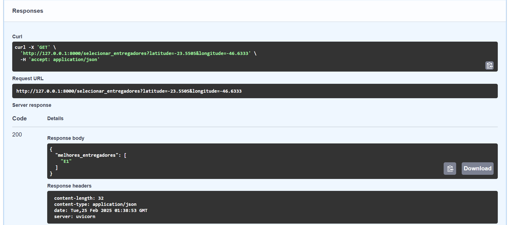<br>
  <sup>Fonte: Rappitors</sup>
</div>

# 5. Especificação da Solução Técnica como Código

&emsp;&emsp;Nesta etapa de desenvolvimento, o grupo de desenvolvedores Rappitors avançou as análises voltadas aos mecanismos de engenharia. Nesse sentido, a evolução do projeto segue os direcionamentos de garantir o a qualidade de software ao assegurar o sincronismo com versões de atualizações tecnológicas de integrações internas e externas.

&emsp;&emsp;Assim, as lógicas foram desenvolvidas para a identificação e monitoramento do sistema, como por exemplo as integrações entre tecnologias que expõem a saúde das APIs e comunicações. A seguir, explora-se o desenvolvimento construído no contexto de negócios da Rappi, com assinaturas de versões, integrações e métricas de medição do desempenho do sistema.

&emsp;&emsp;Caso deseje fazer funcionar na sua máquina local, siga os seguintes passos (tendo o repositório clonado):

1. Tenha o docker instalado

2. Abra a UI do docker

3. Na raiz do projeto ``` docker-compose up --build -d ```

- isso fara com que as imagens sejam copiadas e os containers executados.

<div align="center">
  <sub>Figura 16: Docker</sub><br>
  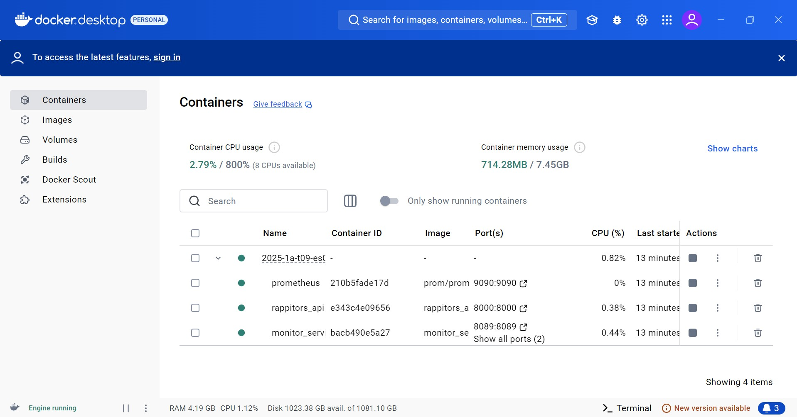<br>
  <sup>Fonte: Rappitors</sup>
</div>

4. Os serviçoes ficaram disponíveis em:

a) rappitors_api: http://localhost:8000/docs
b) Locust: http://localhost:8089/
c) Prometheus: http://localhost:9090/
d) Grafana: http://localhost:3000/

# 5.1 Monitoramento com Prometheus e Graphana

Com a api central disponível, é possível realializar o monitoramento do sistema.

<div align="center">
  <sub>Figura 17: Rappitors API</sub><br>
  <br>
  <sup>Fonte: Rappitors</sup>
</div>

A partir do Locust, define-se o teste de carga com números de usuários conectados por segundo. Na figura abaixo, é possível verificar que a cada segundo, 100 usuários novos serão conectados no sistema, até o sistema alcançar 8000 usuários conectados.

<div align="center">
  <sub>Figura 18: Locust</sub><br>
  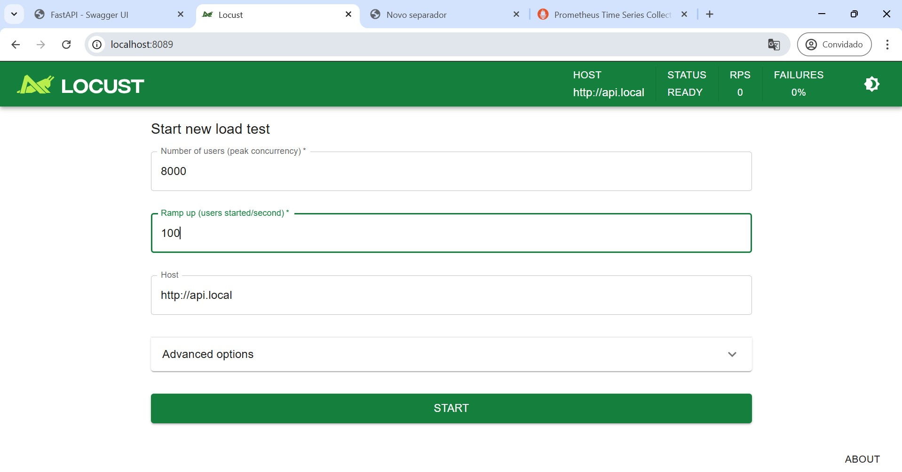<br>
  <sup>Fonte: Rappitors</sup>
</div>

O teste de carga começa e as requisições são realizadas gerando dados importantes como: número de requisições por segundo, tempo de resposta e numero de usuários conectados.

<div align="center">
  <sub>Figura 19: Teste de Carga Locust</sub><br>
  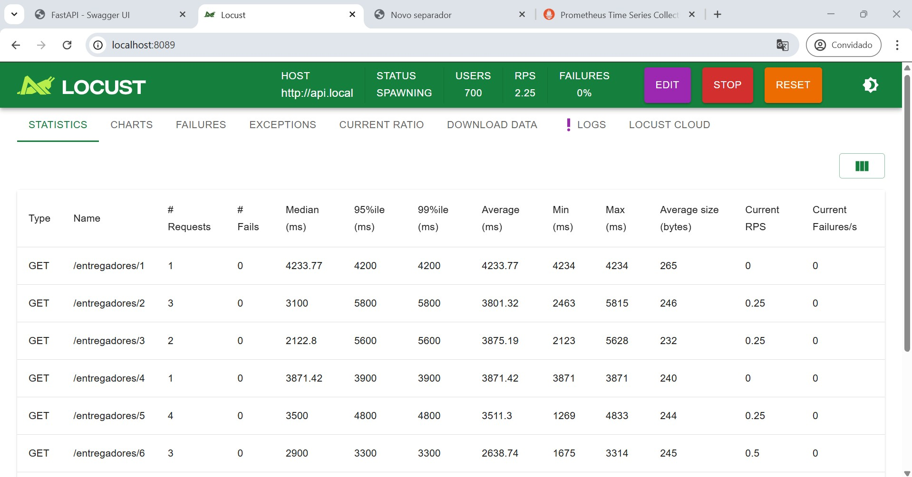<br>
  <sup>Fonte: Rappitors</sup>
</div>

Também é possível verificar esses dados por meio de gráficos, que mostram o comportamento do sistema em tempo real, diretamente no locust:

<div align="center">
  <sub>Figura 20: Graficos Locust</sub><br>
  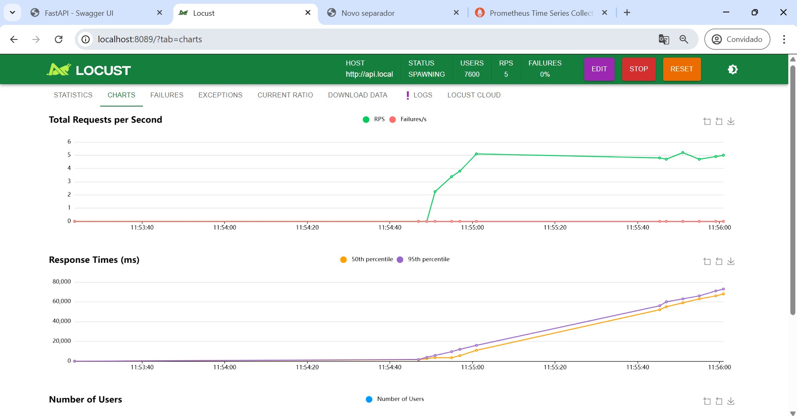<br>
  <sup>Fonte: Rappitors</sup>
</div>

As métricas levantadas a partir do Locust são expostas na rota nativa do Prometheus: ```/metrics```.

<div align="center">
  <sub>Figura 21: Exposição de Métricas Locust -- Prometheus</sub><br>
  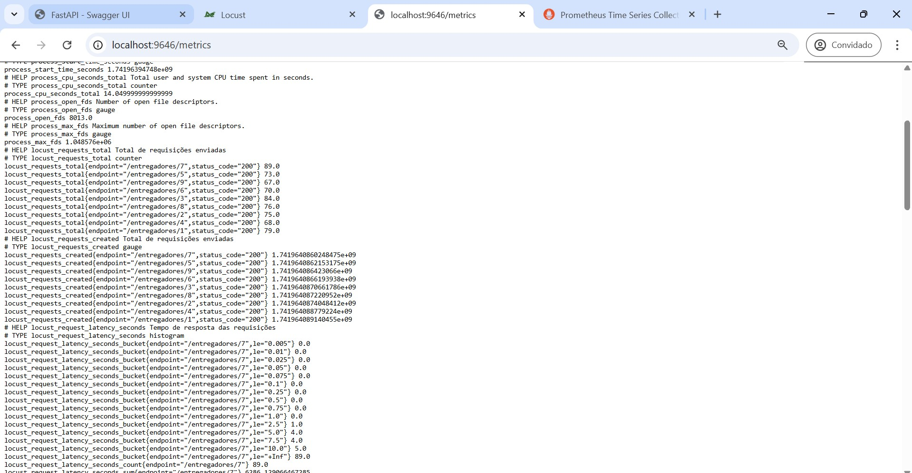<br>
  <sup>Fonte: Rappitors</sup>
</div>

Direciona-se o Prometheus ao conteiner ```monitor_service```, que expõe as métricas coletadas pela rota mencionada anteriormente em ```localhost:9090/target```.

<div align="center">
  <sub>Figura 22: Prometheus Target</sub><br>
  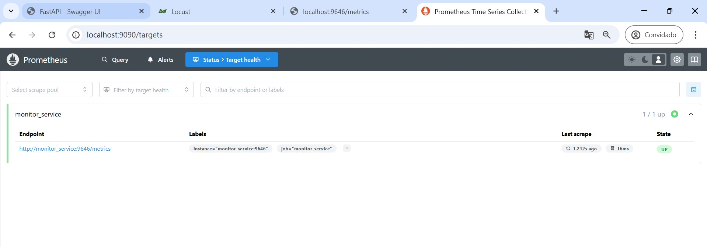<br>
  <sup>Fonte: Rappitors</sup>
</div>

Os dados dessas métricas podem ser consultados diretamente no sistema do prometheus, na rota ```localhost:9090```.

<div align="center">
  <sub>Figura 23: Prometheus Monitorando</sub><br>
  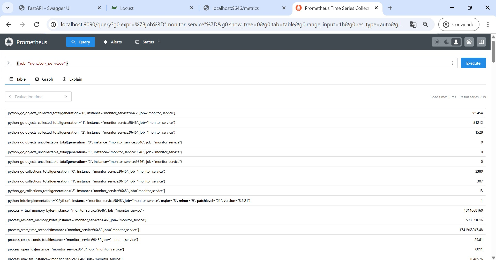<br>
  <sup>Fonte: Rappitors</sup>
</div>

Por fim, os dados do Prometheus são exibidos no Grafana, uma ferramenta de visualização de dados que permite a criação de dashboards personalizados. Ele pode ser acessado através da rota ```localhost:3000```, por meio de um usuário e senha. 

<div align="center">
  <sub>Figura 24: Dashboard</sub><br>
  <br>
  <sup>Fonte: Rappitors</sup>
</div>

Nesse momento do desenvolvimento, o dashboard foi criado para exibir algumas métrica do locust, principalmente relacionadas ao monitoramento do tempo de resposta. 

Os dois gráficos presentes no dashboard apresentam a latência média das requisições no sistema. O primeiro, situado na esquerda, é um gráfico de série temporal que mostra o dado da latência em função do tempo. O segundo, à direita, agrupa essas informações por endpoint, conseguindo informar em quais endpoints a latência está mais alta, facilitando a correção de problemas.

<div align="center">
  <sub>Figura 25: Dashboard</sub><br>
  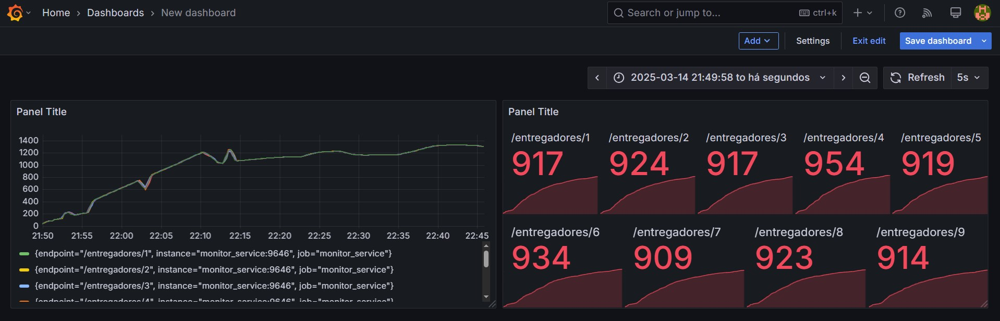<br>
  <sup>Fonte: Rappitors</sup>
</div>

Essas relações podem ser combinadas para identificar os principais gargalos e pontos de melhoria no sistema, otimizando a alocação de recursos para as correções necessárias.

#### Considerações finais

&emsp;&emsp;O desempenho de um sistema precisa ser observado com atenção, pois não se trata de algo estático ou isolado, mas de uma resposta contínua às interações e cargas que recebe. Um software pode ser projetado com eficiência, mas sua performance real só pode ser verdadeiramente compreendida quando visto em funcionamento, lidando com as demandas do mundo real. Métricas, logs e monitoramento são as lentes que permitem enxergar além do código, trazendo clareza sobre gargalos, tempos de resposta e o impacto das decisões arquiteturais.

&emsp;&emsp;Mais do que apenas rodar instruções, um sistema precisa desenvolver uma visão sobre si mesmo. Ele deve ser capaz de interpretar seus próprios limites, antecipar falhas e reagir dinamicamente às oscilações de carga e recursos disponíveis. Ferramentas de observabilidade e automação tornam essa autoconsciência possível, permitindo que o sistema ajuste seu comportamento para garantir um funcionamento contínuo e eficiente, mesmo diante de variações inesperadas.

&emsp;&emsp;O código, por si só, não gera valor se estiver isolado de seu ambiente de execução. O sistema é vivo, e seu comportamento vai além das linhas de código que o compõem. Um requisito não funcional como desempenho não pode ser reduzido a um conjunto de boas práticas ou padrões escritos; ele emerge da forma como as partes interagem, como os recursos são alocados e como os usuários realmente o utilizam. Um código bem escrito pode ser um ótimo ponto de partida, mas sem um ecossistema que favoreça sua execução, não há como garantir que os requisitos serão atendidos na prática.

&emsp;&emsp;A performance de um sistema não é uma constante, mas sim um reflexo das condições em que ele opera. Ela varia de acordo com os recursos que estão sendo consumidos, com a concorrência de acessos e com a complexidade das operações que estão em andamento. Um mesmo código pode rodar de forma fluida em um momento e apresentar lentidão em outro, dependendo da carga e das configurações de infraestrutura. Dessa forma, otimizar a performance não é apenas escrever código eficiente, mas também entender o contexto em que esse código será executado e como ele pode se adaptar às circunstâncias em tempo real.

# 5.2 Monitoramento de Assinatura de Versão
  
&emsp;&emsp;O serviço de validação de versão das APIs tem como objetivo garantir que as integrações do sistema estejam utilizando a versão correta dos serviços externos. Ele compara a versão salva no banco de dados com a versão fornecida pelos serviços em tempo de execução. Caso haja discrepâncias, um alerta é gerado para indicar que a integração precisa ser atualizada.

## Tecnologias Utilizadas
- Python
- Firebase Realtime Database
- Asyncio
- Aiohttp
- Logging

## Como Funciona
1. O serviço acessa o Firebase Realtime Database para obter a versão esperada de cada serviço externo.
2. Ele consulta os serviços através de requisições HTTP GET no endpoint `/protocolo`.
3. Compara a versão esperada (do banco de dados) com a versão retornada pelo serviço consultado.
4. Se as versões forem iguais, o sistema continua funcionando normalmente.
5. Se houver divergência, um alerta é gerado informando a necessidade de atualização da integração.
6. O serviço realiza essa verificação periodicamente a cada 10 segundos.

## Fluxo de Execução
1. **Inicialização do Firebase**: Se não houver uma instância ativa, o Firebase é inicializado com as credenciais fornecidas.
2. **Busca da versão esperada**: O serviço acessa o banco de dados e obtém a versão esperada dos serviços externos.
3. **Consulta aos serviços externos**: Faz uma requisição HTTP para obter a versão atual de cada serviço.
4. **Comparação das versões**:
   - Se forem iguais, o serviço está atualizado.
   - Se forem diferentes, é gerado um alerta.
5. **Execução Contínua**: A verificação ocorre continuamente em intervalos de 10 segundos.


<div align="center">
  <sub>Figura 26: Rota com o versionamento da api</sub><br>
  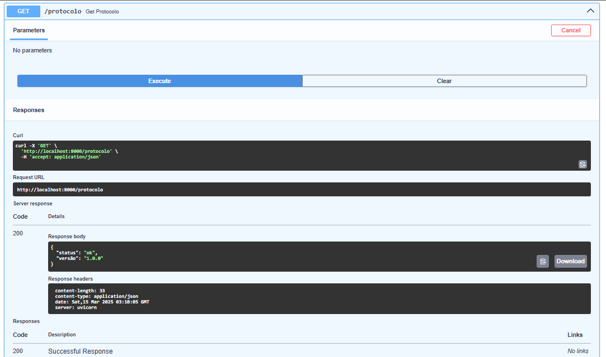<br>
  <sup>Fonte: Rappitors</sup>
</div>

## Estrutura do Banco de Dados
O banco de dados Firebase armazena as versões esperadas dos serviços no seguinte formato:

```json
{
    "protocolos": {
        "rappitors_api": "1.0.0",
        "outro_servico": "2.3.1"
    }
}
```
## Endpoints Consultados
O serviço verifica a versão de cada serviço externo consultando seus respectivos endpoints:

- **Exemplo de Endpoint:** `http://rappitors_api:8000/protocolo`
- **Resposta esperada:**
  ```json
  {
      "status": "ok",
      "versão": "1.0.0"
  }

## Logs e Monitoramento
O serviço gera logs detalhados sobre o processo de verificação:
- Informativos quando a verificação é realizada corretamente.
- Warnings quando a versão de um serviço está desatualizada.
- Erros quando a resposta de um serviço não é válida ou não é possível acessar o endpoint.

## Possíveis Erros e Soluções
| Erro | Causa Possível | Solução |
|------|----------------|------------|
| `Protocolo para X não encontrado no banco de dados` | O banco de dados não contém informações sobre o serviço | Adicionar a versão esperada no Firebase |
| `Falha ao verificar X. Status: Y` | O endpoint do serviço pode estar offline ou com erro | Verificar se o serviço está funcionando corretamente |
| `Protocolo para X desatualizado` | A versão do serviço foi alterada | Atualizar as integrações para a nova versão |

## Conclusão
&emsp;&emsp;Este serviço garante a consistência das integrações verificando continuamente a versão de cada serviço externo utilizado pelo sistema. Caso uma diferença seja detectada, ele alerta sobre a necessidade de atualização para evitar incompatibilidades.

<div align="center">
  <sub>Figura 27: Cronjob - verificação de protocolo</sub><br>
  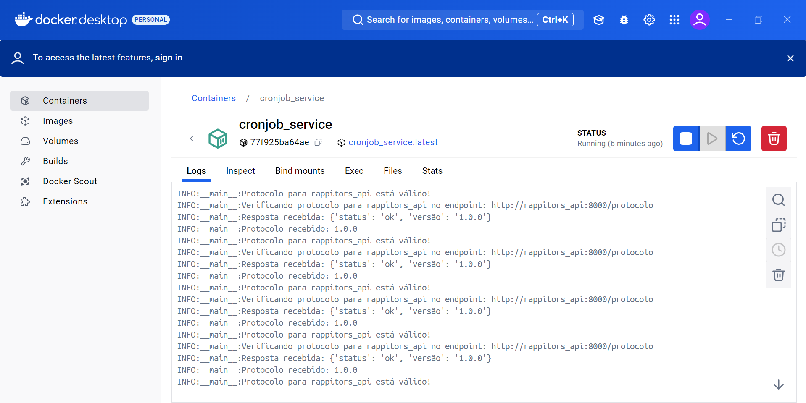<br>
  <sup>Fonte: Rappitors</sup>
</div>

# 5.3 Integração com API de Geolocalização

&emsp;&emsp;Esta API tem como objetivo fornecer serviços de geolocalização e alocação de entregadores, utilizando **OpenStreetMap (OSM) + Nominatim** para obtenção de coordenadas e conversão entre endereços e coordenadas geográficas. Além disso, a API usa o **Firebase** para armazenar e gerenciar a localização dos entregadores em tempo real.

&emsp;&emsp;O **Nominatim** é um serviço que permite transformar endereços em coordenadas e vice-versa, sendo essencial para o funcionamento das rotas de alocação de entregadores.


## Dependências
A API utiliza as seguintes dependências:
- `firebase_admin` - Para interação com o Firebase Realtime Database.
- `geopy.geocoders.Nominatim` - Para conversão de endereços em coordenadas geográficas e vice-versa.
- `geopy.distance` - Para cálculo da distância entre pontos geográficos.
- `time` - Para controlar intervalos entre tentativas de alocação de entregadores.
- `typing.List` e `typing.Dict` - Para tipagem dos retornos das funções.

---

## Módulo `Location.py`
O módulo `Location.py` é responsável pela obtenção e atualização da localização dos entregadores.

### Funções
#### `obter_coordenadas(endereco: str) -> dict`
Obtém as coordenadas geográficas de um endereço fornecido utilizando **Nominatim**.
##### Parâmetros:
- `endereco` (str): Endereço a ser convertido em coordenadas.
##### Retorno:
- `dict`: Dicionário contendo `latitude` e `longitude`, ou um erro caso o endereço não seja encontrado.

#### `obter_endereco(latitude: float, longitude: float) -> dict`
Converte coordenadas geográficas em um endereço textual utilizando **Nominatim**.
##### Parâmetros:
- `latitude` (float): Latitude da localização.
- `longitude` (float): Longitude da localização.
##### Retorno:
- `dict`: Dicionário contendo `endereco`, ou um erro caso as coordenadas não sejam encontradas.

#### `atualizar_localizacao(entregador_id: int, latitude: float = None, longitude: float = None, endereco: str = None) -> dict`
Atualiza a localização de um entregador no Firebase.
##### Parâmetros:
- `entregador_id` (int): ID do entregador.
- `latitude` (float): Latitude da localização.
- `longitude` (float): Longitude da localização.
- `endereco` (str, opcional): Endereço para conversão em coordenadas.
##### Retorno:
- `dict`: Mensagem de sucesso ou erro.

---

## Módulo `Alocation.py`
O módulo `Alocation.py` é responsável por buscar entregadores dentro de um raio e selecionar os mais adequados para uma entrega.

### Funções
#### `buscar_entregadores_por_raio(latitude: float, longitude: float, raio_metros: int) -> List[Dict]`
Busca entregadores disponíveis dentro de um raio específico.
##### Parâmetros:
- `latitude` (float): Latitude do ponto central.
- `longitude` (float): Longitude do ponto central.
- `raio_metros` (int): Raio da busca em metros.
##### Retorno:
- `List[Dict]`: Lista de entregadores dentro do raio, contendo ID, saldo e distância.

#### `selecionar_entregadores(latitude: float, longitude: float) -> List[str]`
Seleciona os três melhores entregadores dentro de um raio progressivo.
##### Parâmetros:
- `latitude` (float): Latitude do ponto de entrega.
- `longitude` (float): Longitude do ponto de entrega.
##### Retorno:
- `List[str]`: Lista de IDs dos três melhores entregadores.

---

## Rotas da API

### `POST /responder_pedido`
Aceita um pedido para um entregador que já foi indicado como candidato.

#### Parâmetros:
- `pedido_id` (int) - ID do pedido.
- `entregador_id` (int) - ID do entregador.

#### Resposta:
- `200 OK`: Pedido aceito pelo entregador.
- `404 Not Found`: Pedido não encontrado.
- `400 Bad Request`: Entregador não está na lista de candidatos.

---

### `GET /pedidos_atribuidos`
Verifica pedido atribuído a entregadores disponíveis, utilizando a localização do pedido.

#### Parâmetros:
- `pedido_id` (int) - ID do pedido.
- `latitude` (float, opcional) - Latitude do pedido.
- `longitude` (float, opcional) - Longitude do pedido.
- `endereco` (str, opcional) - Endereço do pedido (convertido em coordenadas via **Nominatim**).

#### Resposta:
- `200 OK`: Lista dos candidatos ao pedido.
- `404 Not Found`: Pedido ou entregadores não encontrados.
- `400 Bad Request`: Endereço ou coordenadas inválidas.

<div align="center">
  <sub>Figura 28: GET/pedidos_atribuidos</sub><br>
  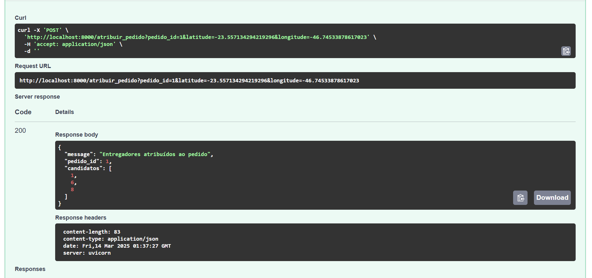<br>
  <sup>Fonte: Rappitors</sup>
</div>

---

### `POST /localizacao`
Atualiza a localização de um entregador.

#### Parâmetros:
- `entregador_id` (int) - ID do entregador.
- `latitude` (float, opcional) - Latitude da nova localização.
- `longitude` (float, opcional) - Longitude da nova localização.
- `endereco` (str, opcional) - Endereço a ser convertido em coordenadas via **Nominatim**.

#### Resposta:
- `200 OK`: Localização atualizada com sucesso.
- `404 Not Found`: Entregador não encontrado.
- `400 Bad Request`: Informações de localização inválidas.

>obs: Os parâmetros de latitude e longitude precisam estar em conformidade com os dados registrados no banco de dados (firebase), assim como com o id de entregador. Isso garante confiabilidade ao sistema.

<div align="center">
  <sub>Figura 29: Integração com a API de geolocalização</sub><br>
  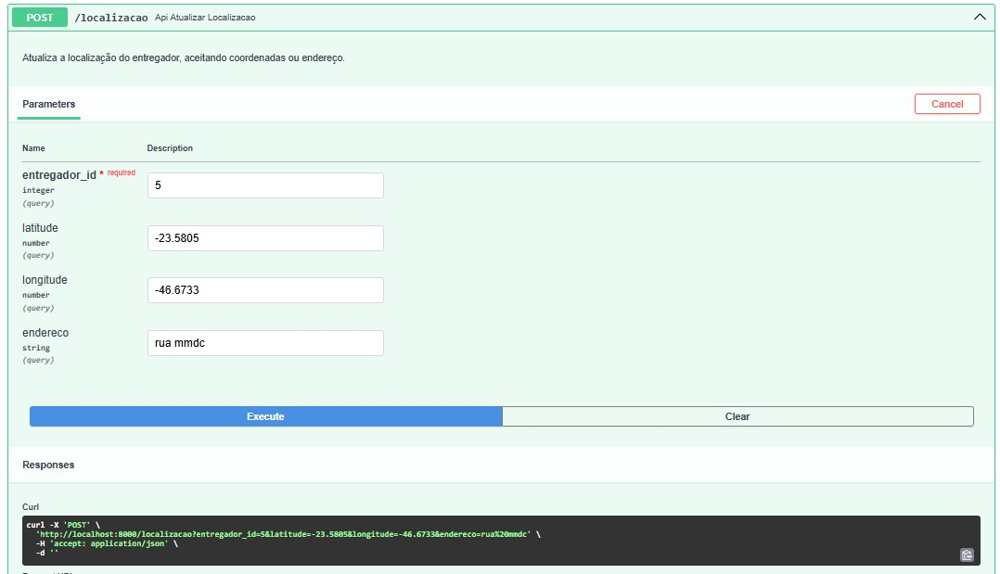<br>
  <sup>Fonte: Rappitors</sup>
</div>

<div align="center">
  <sub>Figura 30: Integração com a API de geolocalização</sub><br>
  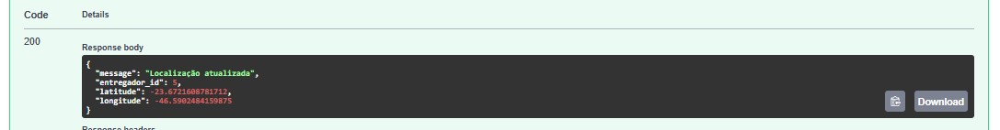<br>
  <sup>Fonte: Rappitors</sup>
</div>

---

## Fluxo de Funcionamento
1. **Cadastro da localização do entregador**:
   - O sistema recebe um endereço ou coordenadas e atualiza a localização no Firebase.

2. **Busca de entregadores**:
   - Quando um pedido de entrega é feito, o sistema busca entregadores disponíveis dentro de um raio inicial de 500 metros.
   - Caso não encontre, expande o raio em 500 metros a cada minuto, até um máximo de 6 minutos.

3. **Seleção dos melhores entregadores**:
   - Os entregadores encontrados são ordenados por saldo (descendente) e depois por distância (ascendente).
   - Os três melhores entregadores são selecionados para a entrega.

## Testes da API de Geolocalização

&emsp;&emsp;Este documento descreve os testes automatizados para validar as funcionalidades da API de geolocalização e alocação de entregadores. Os testes foram implementados utilizando **pytest** e verificam a obtenção de coordenadas, conversão de endereços e atualização da localização no Firebase.

<div align="center">
  <sub>Figura 31: Testes de Geolocalização Validados</sub><br>
  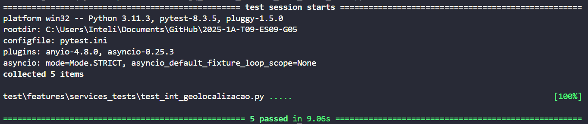<br>
  <sup>Fonte: Rappitors</sup>
</div>

## Estrutura dos Testes
&emsp;&emsp;Os testes devem ser organizados dentro do diretório `src`, garantindo que possam ser executados corretamente. O Firebase precisa estar devidamente configurado para que os testes que interagem com o banco de dados funcionem corretamente.

## Teste para `obter_coordenadas()`

&emsp;&emsp;Essa função recebe um endereço como entrada e retorna suas coordenadas geográficas (latitude e longitude).

```python
@pytest.mark.parametrize("endereco, esperado", [
    ("Avenida Paulista, São Paulo", True),
    ("Localização Inexistente XYZ", False)
])
def test_obter_coordenadas(endereco, esperado):
    resultado = obter_coordenadas(endereco)
    if esperado:
        assert "latitude" in resultado and "longitude" in resultado
    else:
        assert "error" in resultado
```
```

📌 **Explicação**:

- O `parametrize` permite testar múltiplos endereços.
- Caso o endereço seja válido, o teste verifica se a resposta contém latitude e longitude.
- Se o endereço for inválido, o teste verifica se a resposta contém uma chave `error`.

## Teste para `obter_endereco()`

&emsp;&emsp;Essa função recebe coordenadas (latitude e longitude) e retorna um endereço formatado.

```python
@pytest.mark.parametrize("latitude, longitude, esperado", [
    (-23.561, -46.656, True),
    (0, 0, False)
])
def test_obter_endereco(latitude, longitude, esperado):
    resultado = obter_endereco(latitude, longitude)
    if esperado:
        assert "endereco" in resultado
    else:
        assert "error" in resultado
```

📌 **Explicação**:

- O `parametrize` permite testar diferentes coordenadas.
- Se as coordenadas forem válidas, o teste verifica se a resposta contém `endereco`.
- Se forem inválidas, verifica se a resposta contém `error`.

## Teste para `atualizar_localizacao()`

&emsp;&emsp;Essa função atualiza a localização de um entregador no Firebase.

```python
@pytest.mark.asyncio
async def test_atualizar_localizacao():
    resposta = await atualizar_localizacao("entregador_123", -23.561, -46.656)
    assert resposta == {"message": "Localização atualizada"}
```

📌 **Explicação**:

- O `@pytest.mark.asyncio` indica que a função é assíncrona.
- O teste chama `atualizar_localizacao()` com um ID de entregador e coordenadas.
- A resposta esperada deve ser `{"message": "Localização atualizada"}`.

## Considerações Finais
&emsp;&emsp;Esta API permite uma alocação eficiente de entregadores baseada em localização, priorizando rapidez e disponibilidade. Possíveis melhorias incluem:
- Otimização do tempo de resposta utilizando filas de processamento assíncronas.
- Adição de parâmetros dinâmicos para ajustar o raio e as tentativas conforme a demanda.

# 5.4 Integração com API de Clima

&emsp;&emsp;A integração com a API de clima tem como objetivo fornecer informações sobre as condições meteorológicas atuais de uma cidade, por meio da consulta à API externa `https://wttr.in`. A informação retornada inclui a condição climática (por exemplo, "Nuvens") e a temperatura atual (por exemplo, "22°C"). Essa integração é utilizada para exibir dados climáticos em tempo real na aplicação, permitindo que a plataforma tome decisões com base nas condições meteorológicas.

<div align="center">
  <sub>Figura 32: Api externa wttr.in</sub><br>
  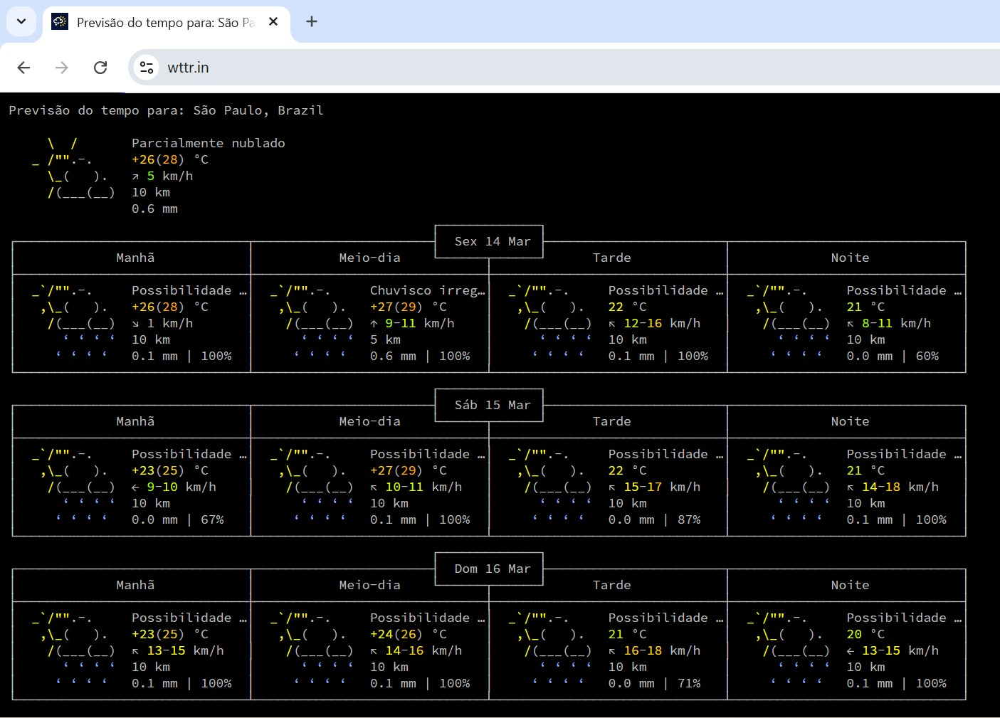<br>
  <sup>Fonte: wttr.in</sup>
</div>

#### **Tecnologias Utilizadas**
- **Biblioteca HTTP**: `httpx` (cliente HTTP assíncrono)
- **Framework Web**: FastAPI
- **Tratamento de Erros**: Utilização da classe `HTTPException` do FastAPI para o manejo adequado de exceções e fornecimento de respostas apropriadas ao cliente.

#### **Função `obter_clima`**
A função `obter_clima` realiza uma solicitação assíncrona à API externa `https://wttr.in`, obtendo o clima de uma cidade específica. Caso o parâmetro `cidade` seja fornecido como `"auto"`, a API retornará as condições meteorológicas da localização atual.

```python
import httpx
from fastapi import HTTPException

async def obter_clima(cidade: str = "auto"):
    url = f"https://wttr.in/{cidade}?format=%C+%t"
    
    try:
        async with httpx.AsyncClient() as client:
            resposta = await client.get(url)
            resposta.raise_for_status()  # Garante que erros HTTP sejam levantados
            return {"cidade": cidade, "clima": resposta.text}
    except httpx.HTTPStatusError as e:
        raise HTTPException(status_code=e.response.status_code, detail=f"Erro ao obter clima: {str(e)}")
    except httpx.RequestError as e:
        raise HTTPException(status_code=500, detail=f"Erro de requisição: {str(e)}")
```

#### **Rota da API**

**GET `/clima`**:
  - **Descrição**: Endpoint que retorna as informações sobre o clima de uma cidade.
  - **Parâmetros**:
    - `cidade` (opcional): Nome da cidade para obter as condições climáticas. O valor `"auto"` é aceito para obter o clima automaticamente com base na localização do usuário.
  - **Resposta**:
    - A resposta será um objeto JSON contendo o nome da cidade e a descrição das condições climáticas.
    - **Exemplo de resposta**:
      ```json
      {
        "cidade": "auto",
        "clima": "Nuvens + 22°C"
      }
      ```
  - **Exemplo de chamada**:
    ```http
    GET /clima?cidade=auto
    ```

<div align="center">
  <sub>Figura 33: Resposta Requisição</sub><br>
  <br>
  <sup>Fonte: Rappitors</sup>
</div>


#### **Manejo de Erros**
A função `obter_clima` possui um tratamento de exceções:
- **HTTPStatusError**: Caso a API externa retorne um erro de status HTTP (por exemplo, uma cidade não encontrada), a função lança uma exceção com o código de status apropriado.
- **RequestError**: Para outros tipos de falhas na requisição (como problemas de conectividade), a função gera uma resposta com status 500 e uma mensagem de erro genérica.

#### **Implementação no FastAPI**
O FastAPI utiliza a função `obter_clima` em uma de suas rotas para fornecer as informações climáticas ao cliente. A implementação segue o padrão de boas práticas, garantindo que a API esteja devidamente configurada e pronta para receber requisições:

```python
@app.get("/clima")
async def clima(cidade: str = Query(default="auto", description="Nome da cidade ou 'auto' para detecção automática")):
    return await obter_clima(cidade)
```

A integração com a API de clima foi realizada de forma a proporcionar dados meteorológicos atualizados, permitindo que a plataforma ofereça informações relevantes e oportunas aos usuários, com o uso dessa api é possível calcular as taxas de entregas de acordo com o clima, conforme a imagem abaixo:

<div align="center">
  <sub>Figura 34: Resposta Requisição</sub><br>
  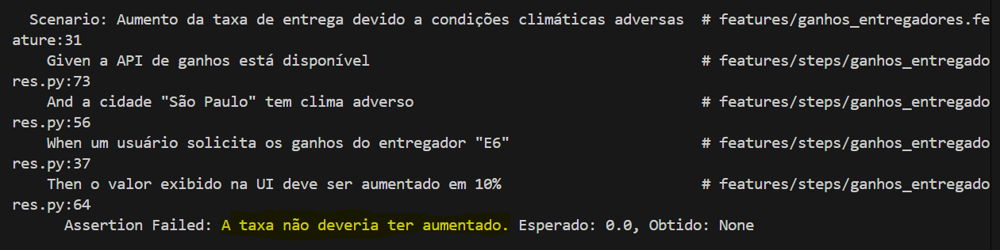<br>
  <sup>Fonte: Rappitors</sup>
</div>

Em suma, no contexto acima o clima não estava com condições adversas, dessa maneira, o teste passou e retornou como resposta que a taxa não deveria aumentar, o que estpa correto. Ademais, em um cenário de condições climáticas adversas, esse teste retorna que a taxa será aumentada devido as essas condições.

O tratamento de erros foi cuidadosamente implementado para garantir uma resposta adequada, mesmo em situações de falha. A aplicação foi estruturada para facilitar a realização de testes de integração, assegurando que todas as funcionalidades estejam operando conforme esperado.

Caso haja a necessidade de expandir a integração, como adicionar novos parâmetros ou funcionalidades (por exemplo, previsão do tempo), o processo de alteração ou adição de novas rotas será simples e pode ser feito sem dificuldades.

# 6. Dashboard de Código de Qualidade

&emsp;&emsp;Dando continuidade ao raciocínio apresentado nas seções anteriores, esta seção aborda a visualização das métricas coletadas pelo sistema. A imagem a seguir ilustra o fluxo completo — desde a coleta e simulação de dados até a construção dos dashboards utilizados para análise. Esse processo é essencial para compreender o comportamento da aplicação em tempo real, permitindo o monitoramento da saúde dos serviços, e da performance sob carga.

<div align="center">
  <sub>Figura 35: Arquitetura de métricas Rappitors</sub><br>
  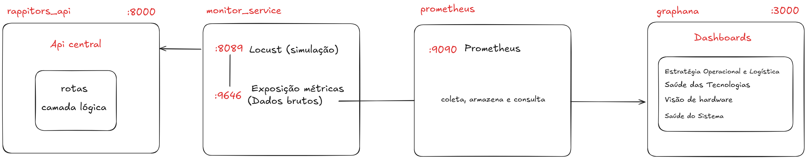<br>
  <sup>Fonte: Rappitors</sup>
</div>

&emsp;&emsp;No ambiente de visualização construído com o Grafana, foram definidos quatro dashboards principais, cada um com um foco específico de análise, alinhado a diferentes dimensões do sistema. O primeiro dashboard, "Estratégia Operacional e Logística", tem como objetivo fornecer uma visão orientada ao negócio, destacando aspectos relacionados à operação e eficiência logística. O segundo, "Saúde do Sistema", concentra-se no monitoramento de requisitos não funcionais, acompanhando a estabilidade e confiabilidade da aplicação. O terceiro dashboard, "Saúde das Tecnologias" permite acompanhar o comportamento e o desempenho das tecnologias utilizadas no ambiente. Juntos, esses painéis oferecem uma análise abrangente e segmentada, facilitando o diagnóstico e a tomada de decisões em diferentes níveis da operação.

## 6.1 Estratégia Operacional e Logística

&emsp;&emsp;O Dashboard de Estratégia Operacional e Logística tem como objetivo monitorar e otimizar o tempo de operação dos entregadores, garantindo maior eficiência na distribuição de pedidos. A ferramenta proporciona visibilidade sobre indicadores-chave que impactam diretamente a performance das entregas, permitindo uma gestão mais assertiva dos recursos disponíveis. 

&emsp;&emsp;Um dos principais aspectos avaliados na alocação de entregadores é o tempo de aceitação do pedido. Esse indicador mede o intervalo entre a notificação enviada ao entregador e o momento em que ele aceita a entrega. No código, essa métrica é fundamental para otimizar a logística da plataforma. A função alocar_entregador inicia registrando o tempo da requisição `(start_request_time)` e busca os entregadores disponíveis no sistema através da função `buscar_entregadores_disponiveis()`. Caso não haja entregadores disponíveis, a resposta retorna um `erro (404)`, indicando que nenhum profissional está apto para atender a demanda.

&emsp;&emsp;O processo de alocação considera a proximidade entre o entregador e o local do pedido. Para isso, a função `calcular_distancia()` determina a distância geográfica entre os pontos, garantindo que a alocação priorize os entregadores mais próximos. Inicialmente, o sistema adota um raio fixo de **30 km** e tenta encontrar candidatos dentro dessa área. Se nenhum entregador for encontrado ou se todos recusarem o pedido, **o código expande progressivamente o raio de busca em incrementos de 0.5 km**. Esse mecanismo evita tempos de espera excessivos e distribui as entregas de forma eficiente.

&emsp;&emsp;A lógica de aceitação de pedidos é simulada por meio de um sorteio probabilístico, onde há uma chance de 70% de o entregador aceitar e 30% de recusar `(random.choices([True, False], weights=[0.7, 0.3])[0])`. Além disso, o código introduz um pequeno atraso aleatório de 0.5 a 3 segundos `(time.sleep(random.uniform(0.5, 3.0)))`, simulando o tempo real que um entregador levaria para responder à notificação. Caso um entregador aceite o pedido, a função retorna informações como seu identificador, o tempo total de execução, a distância percorrida e a condição climática no momento da alocação.

&emsp;&emsp;Outro fator crítico no modelo é a influência das condições climáticas. O código implementa um mecanismo para atualizar o status do clima a cada minuto usando a função `atualizar_clima()`, que aleatoriamente define se as condições são instáveis ou favoráveis à entrega. Esse fator impacta a disponibilidade dos entregadores, visto que, em dias chuvosos, a taxa de aceitação pode ser menor devido ao aumento do tempo de deslocamento e aos riscos na condução. Essa variável é incluída no retorno da alocação, permitindo ajustes estratégicos, como a oferta de incentivos para entregadores em momentos adversos.

&emsp;&emsp;Por fim, a análise do tempo de permanência do entregador em cada status da entrega operacional permite identificar oportunidades de otimização no fluxo logístico. Ao monitorar o tempo gasto em status como "aguardando retirada", "em rota" e "entregue", é possível detectar padrões de ineficiência e desenvolver soluções para redução do tempo total de operação. Esse monitoramento possibilita a implantação de medidas corretivas que aumentam a produtividade e melhoram a experiência do consumidor final.
  
### 6.1.1 **Visão Geral do Processo de Monitoramento**

O sistema de monitoramento utiliza métricas de tempo, registrando quanto tempo os entregadores permanecem em diferentes estados ao longo do processo de entrega. Esses estados incluem desde a aceitação do pedido até a finalização da entrega. Com isso, é possível analisar onde estão ocorrendo os maiores atrasos e agir para melhorar a eficiência do sistema.

A tabela a seguir descreve os principais estados pelos quais o entregador passa e as métricas associadas a cada um:

| **Estado**               | **Descrição**                                                              | **Métrica Monitorada**                          |
|--------------------------|----------------------------------------------------------------------------|------------------------------------------------|
| **Disponível**            | O entregador está disponível para aceitar novos pedidos.                   | `tempo_estado_sum{estado="disponível"}`       |
| **Aceitou pedido**        | O entregador aceitou um pedido e iniciou o processo de entrega.            | `tempo_estado_sum{estado="aceitou pedido"}`   |
| **A caminho da loja**     | O entregador está a caminho da loja para pegar o pedido.                   | `tempo_estado_sum{estado="a caminho da loja"}`|
| **Aguardando na loja**    | O entregador aguarda na loja para que o pedido seja preparado.             | `tempo_estado_sum{estado="aguardando loja"}`  |
| **A caminho da entrega**  | O entregador está a caminho do cliente com o pedido.                       | `tempo_estado_sum{estado="a caminho entrega"}`|
| **Aguardando cliente**    | O entregador chegou ao endereço de entrega e está aguardando o cliente.    | `tempo_estado_sum{estado="aguardando cliente"}`|
| **Entregue**              | O pedido foi entregue ao cliente.                                          | `tempo_estado_sum{estado="entregue"}`         |

Essas métricas são registradas como *histogramas* no sistema, o que permite calcular o tempo total gasto em cada estado, bem como a frequência com que cada estado é alcançado.

Abaixo, um print de como esse gráfico funciona no grafana:

<div align="center">
  <sub>Figura 36: Arquitetura de métricas Rappitors</sub><br>
  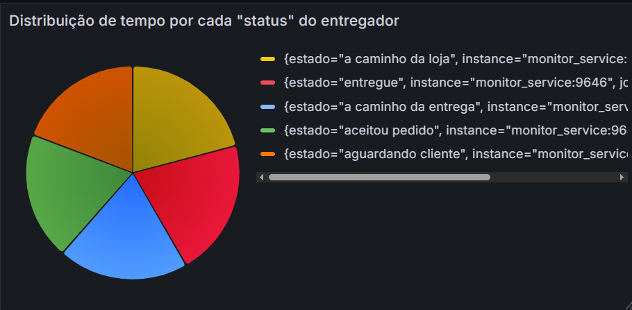<br>
  <sup>Fonte: Rappitors</sup>
</div>

Os dados utilizados estão simulados, por isso o gráfico aparenta essa uniformidade, em um caso real é esperado que tenha uma "fatia" maior que seja identificada como um ponto de melhoria.

#### **Análise Operacional: Identificando Problemas**

A partir dos dados coletados, é possível identificar possíveis gargalos e problemas logísticos. As duas principais áreas de foco são:

1. **Entregadores aguardando muito tempo na entrega (estado: "aguardando cliente")**: Esse dado é crucial para entender se há algum problema de comunicação ou disponibilidade do cliente para receber o pedido. Quando o tempo médio no estado "aguardando cliente" é elevado, isso pode indicar:
   - Falta de disponibilidade do cliente.
   - Problemas na comunicação com o cliente, como número de telefone incorreto ou comunicação falha sobre o status do pedido.

2. **Entregadores demorando muito para chegar até o endereço do pedido (estado: "a caminho da entrega")**: Se os dados mostrarem um tempo elevado neste estado, é necessário investigar:
   - Roteirização ineficiente, com o entregador tomando caminhos mais longos ou ineficazes.
   - Endereço de entrega incorreto ou de difícil acesso.
   - Trânsito ou imprevistos que causam atrasos.

#### **Exemplo de Coleta de Dados e Diagnóstico**

Considerando a seguinte simulação de métricas de tempo e contagem de ocorrências para um entregador:

| **Estado**               | **Tempo Total (s)** | **Número de Ocorrências** | **Tempo Médio (s)** |
|--------------------------|---------------------|---------------------------|---------------------|
| **Aguardando Cliente**    | 1800                | 30                        | 60                  |
| **A caminho da entrega**  | 2400                | 20                        | 120                 |
| **Aceitou Pedido**        | 600                 | 50                        | 12                  |

Se a análise mostrar que o tempo médio no estado "Aguardando Cliente" está muito acima de 60 segundos, isso pode sugerir que a comunicação com o cliente precisa ser otimizada, ou até mesmo verificar questões de disponibilidade do cliente.

No caso de "A caminho da entrega", um tempo médio de 120 segundos pode indicar a necessidade de melhorar o sistema de roteirização ou validar o endereço de entrega, especialmente se o tempo médio for superior ao esperado para a distância entre o ponto de coleta e o cliente.

#### **Plano de Ação**

Com base nas métricas e nas análises, podem ser tomadas as seguintes ações corretivas:

1. **Para entregadores aguardando muito tempo na entrega**:
   - Otimizar a comunicação com os clientes, enviando alertas com antecedência e confirmando a disponibilidade para o recebimento.
   - Implementar um sistema de feedback do cliente que permita identificar rapidamente problemas de disponibilidade.

2. **Para entregadores demorando muito para chegar ao endereço de entrega**:
   - Melhorar o algoritmo de roteirização, utilizando dados em tempo real sobre o tráfego e a localização.
   - Verificar endereços de entrega antes de aceitar o pedido, e permitir ajustes caso o endereço esteja incorreto.

#### **Benefícios Esperados**

- **Visibilidade operacional**: O acompanhamento detalhado dos tempos em cada estado permite detectar rapidamente gargalos e áreas de melhoria.
  
- **Aumento da eficiência**: Com a análise precisa dos tempos de permanência em cada estado, podemos implementar melhorias que resultem em entregas mais rápidas e eficientes.

- **Melhoria na experiência do cliente**: Reduzir os tempos de espera para o cliente, garantindo entregas mais rápidas e sem problemas, resulta em maior satisfação.

Enfim, a implementação oferece uma solução eficiente e escalável para simulação e gerenciamento de entregadores em tempo real, com integração ao Firebase para armazenamento e recuperação de dados. A utilização de threads para simulação paralela de entregadores e o uso de rotas para interação com pedidos e estados permite flexibilidade e alto desempenho no processo de alocação e monitoramento de entregadores.
  
### 6.1.2 Explicação dos Gráficos no Dashboard de Estratégia Operacional e Logística 

**Taxa de Aumento do Tempo de Espera de Alocação Acumulado em Segundos por Minuto**  

<div align="center">
  <sub>Figura 37: Aumento do Tempo de Espera de Alocação Acumulado</sub><br>
  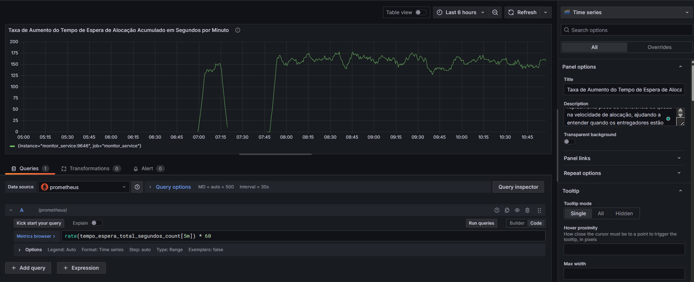<br>
  <sup>Fonte: Rappitors</sup>
</div>

&emsp;&emsp;Este gráfico apresenta a taxa de crescimento do tempo de espera acumulado por minuto ao longo do tempo. O objetivo desse indicador é **identificar rapidamente picos de ineficiência** ou **quedas na velocidade de alocação**, permitindo ajustes estratégicos para melhorar a operação.  

- Se a **Taxa de Aumento do Tempo de Espera de Alocação Acumulado** for **30 segundos por minuto**, significa que, a cada minuto, o tempo total de espera dos entregadores **aumenta em 30 segundos**.  
- Caso essa taxa se mantenha constante, no minuto seguinte o tempo total de espera será **30 segundos maior** do que no minuto anterior.  
- Quando essa taxa sobe abruptamente, pode indicar **falta de entregadores disponíveis, problemas técnicos na alocação ou condições adversas**, como clima ruim ou aumento súbito da demanda.  

**Tempo Médio de Espera da Alocação dos Entregadores em Minutos**  

<div align="center">
  <sub>Figura 38: Tempo Médio de Alocação</sub><br>
  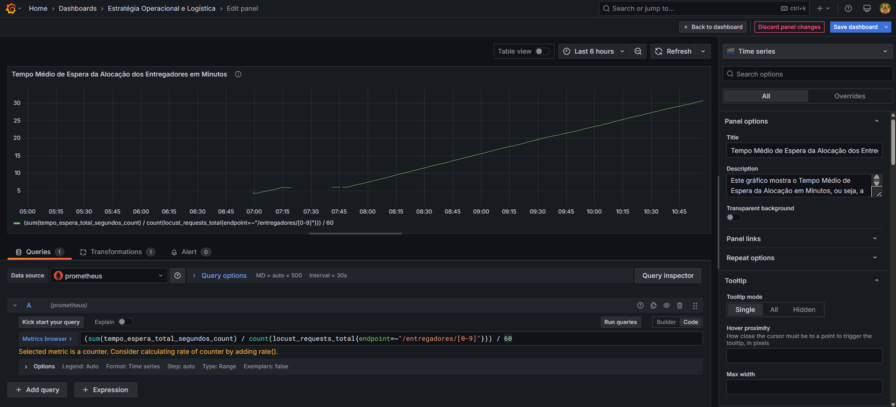<br>
  <sup>Fonte: Rappitors</sup>
</div>

&emsp;&emsp;Este gráfico exibe o Tempo Médio de Espera da Alocação dos entregadores, ou seja, o **tempo médio que cada entregador passa aguardando** para ser alocado a um pedido.  

- Quanto menor esse tempo, **mais eficiente** é o processo de alocação.  
- Se o tempo médio aumentar, pode indicar **problemas operacionais**, como baixa disponibilidade de pedidos, falta de entregadores próximos ou dificuldades no processo de comunicação.  
- Essa métrica auxilia na **tomada de decisões estratégicas**, garantindo que os entregadores **não fiquem parados por muito tempo**, o que pode **aumentar custos operacionais** e reduzir a eficiência da plataforma.  

**Tempo de Espera de Alocação em Relação à Distância Percorrida** 

&emsp;&emsp;Este gráfico exibe a relação entre o **tempo de espera para alocação** e a **distância percorrida** pelos entregadores, permitindo avaliar a eficiência do deslocamento durante o período de espera. 

<div align="center">
  <sub>Figura 39: Tempo Médio de Alocação vs Distância Percorrida</sub><br>
  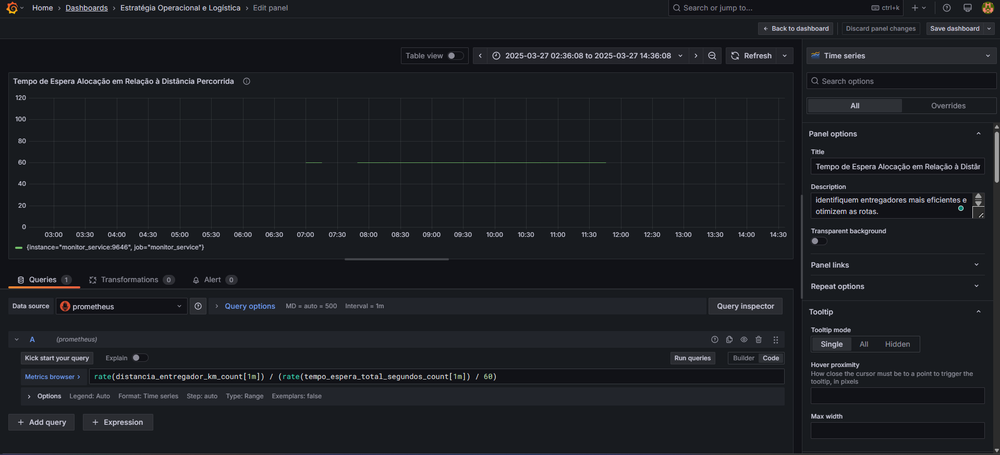<br>
  <sup>Fonte: Rappitors</sup>
</div>

- Se a métrica indicar, por exemplo, **60 km por minuto**, significa que, para cada minuto que o entregador aguarda alocação, ele percorre **60 km**, em média.  
- Valores elevados podem indicar que os entregadores estão otimizando o tempo de espera ao se deslocarem para regiões com maior demanda.  
- Já valores baixos podem sugerir ineficiências operacionais, como tempos de espera prolongados sem movimentação estratégica.  

## 6.2 Saúde do Sistema

&emsp;&emsp;O Dashboard de Saúde do Sistema tem como objetivo monitorar os requisitos não funcionais da aplicação, garantindo que o sistema esteja operando de forma estável e confiável. Esse painel fornece uma visão abrangente do desempenho da aplicação, permitindo identificar rapidamente problemas e tomar ações corretivas.

&emsp; Para o dashboard inicial, foi considerado duas categorias principais de métricas: **Disponibilidade e Erros** e **Desempenho e Latência**. Essas categorias foram escolhidas com base na importância de garantir que o sistema esteja sempre disponível e funcionando corretamente, além de oferecer um desempenho adequado para os usuários.

<div align="center">
  <sub>Figura 40: Dashboard da saúde do sistema</sub><br>
  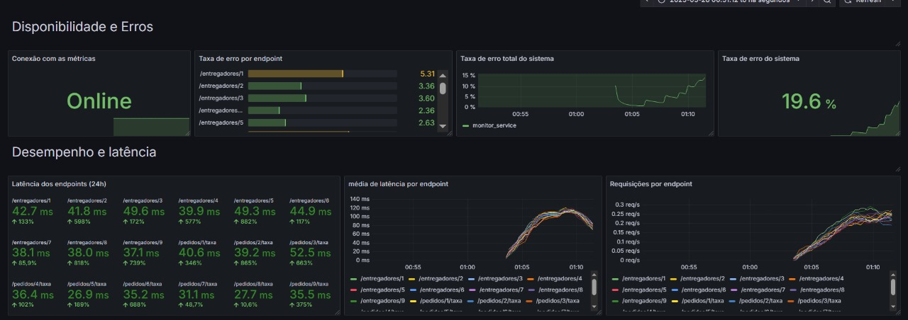<br>
  <sup>Fonte: Rappitors</sup>
</div>

&emsp; As métricas de **Disponibilidade e Erros** incluem informações sobre a conexão com o locust para recebimento das métricas, taxa de erro do sistema em um determiado período, em relação ao tempo e por endpoint.

**Conexão com o Locust**: Essa métrica indica se a aplicação está recebendo dados do locust, que é responsável por simular requisições e gerar carga no sistema. A conexão é verificada e a ausência de dados pode indicar problemas de conectividade ou falhas na aplicação. 

**Taxa de Erro**: Essa métrica mostra a porcentagem de requisições que resultaram em erro em relação ao total de requisições feitas. Uma taxa de erro elevada pode indicar problemas na aplicação ou na infraestrutura.
- Em relação ao tempo: Essa métrica permite identificar padrões ou picos de erro em determinados períodos. Isso pode ser útil na identificação de problemas sazonais ou recorrentes na aplicação.
- Por endpoint: Essa métrica fornece uma visão detalhada de quais endpoints estão falhando mais, permitindo que a equipe de desenvolvimento identifique e resolva problemas específicos. Existe uma oportunidade de trabalhar com pareto, onde é possível identificar quais endpoints que representam a maior parte dos erros e priorizar a resolução de problemas.

&emsp; As métricas de **Desempenho e Latência** incluem informações sobre a latência dos endpoints em determinado período, média de latência por endpoint e o número de requisições por segundo. Essas métricas são essenciais para garantir que a aplicação esteja respondendo rapidamente e atendendo às expectativas dos usuários.
- **Latência dos Endpoints**: Essa métrica indica o tempo médio que cada endpoint levou para responder a uma requisição no período observado. Uma latência elevada pode indicar problemas de desempenho na aplicação ou na infraestrutura. A segmentação por endpoint permite identificar quais partes da aplicação estão apresentando maior latência e priorizar a otimização.
- **Média de Latência por Endpoint**: Essa métrica fornece uma visão detalhada da latência média de cada endpoint, observando um período maior. Isso pode ajudar a identificar tendências de desempenho ao longo do tempo e permitir que a equipe de desenvolvimento tome decisões mais assertivas na arquitetura da aplicação.
- **Número de Requisições por Segundo**: Essa métrica indica quantas requisições a aplicação está recebendo por segundo. Um aumento repentino no número de requisições pode indicar um pico de tráfego ou um ataque DDoS, enquanto uma queda acentuada pode indicar problemas na aplicação ou na infraestrutura. Esse dado é importante para dimensionar a infraestrutura e garantir que a aplicação esteja preparada para lidar com picos de carga, além de poder ser relacionado com a latência dos endpoints, permitindo identificar se o aumento no número de requisições está impactando o desempenho da aplicação.

O dashboard de saúde do sistea reflete o código como documentação viva, onde as métricas são coletadas e apresentadas de forma clara e objetiva. O painel é a maneira de comunicação do código com o time de desenvolvimento e stakeholders, permitindo que todos tenham uma visão clara do desempenho, problemas e oportunidades de melhoria. A automatização da coleta e apresentação de métricas otimiza o tempo e os recursos, permitindo que a equipe se concentre em resolver problemas e melhorar a aplicação.

## 6.3 Saúde das Tecnologias

Este documento descreve a implementação do rastreamento de métricas estáticas do repositório Git, expondo os dados em uma rota específica e monitorando-os através de um dashboard com Prometheus e Grafana.

### Métricas Coletadas
A função implementada coleta as seguintes informações do repositório:
- **Número de arquivos**
- **Número de pastas**
- **Número de linhas de código**
- **Tempo de processamento da GPU**

Os dados são expostos através da rota `/git`.

### Pipeline de Monitoramento
Para visualizar e analisar essas métricas, foi criado um pipeline de monitoramento conforme descrito abaixo:

1. **Simulação de requisições com Locust**
   - O Locust foi utilizado para gerar tráfego na rota `/git`, simulando requisições concorrentes para medir a performance e estabilidade da API.

2. **Coleta de métricas com Prometheus**
   - O Prometheus foi configurado para coletar os dados expostos pela API e armazená-los para análise e visualização.

3. **Visualização no Grafana**
   - Um dashboard no Grafana foi criado para exibir as métricas coletadas, permitindo a análise gráfica do desempenho e estado do repositório.

### Tecnologias Utilizadas
- **Git**: Para análise do repositório.
- **Locust**: Para geração de carga na API.
- **Prometheus**: Para coleta e armazenamento das métricas.
- **Grafana**: Para visualização dos dados coletados.

### Dashboard no Grafana
O dashboard no Grafana exibe:
- Gráficos de evolução do número de arquivos, pastas e linhas de código ao longo do tempo.
- Tempo de processamento da GPU.
- Número de requisições e tempo de resposta da API.
- Análises baseadas nas métricas coletadas pelo Prometheus.

#### Exemplo:
<div align="center">
  <sub>Figura 41: Dashboard Informações Estáticas do Git</sub><br>
  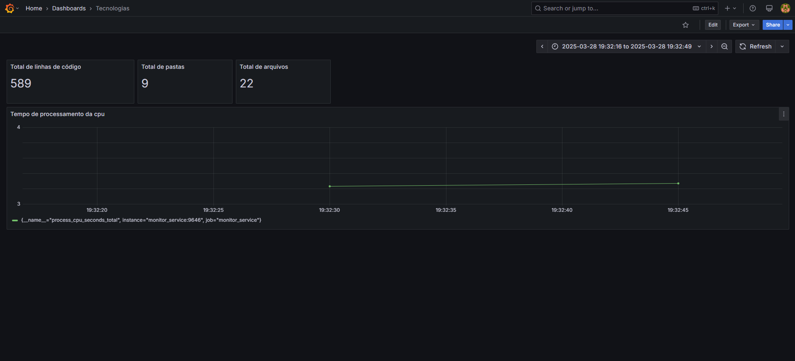<br>
  <sup>Fonte: Rappitors</sup>
</div>

# 7. Conclusão final - Qualidade de Software como Ativo e Sistemas Resilientes

&emsp;&emsp;A qualidade de software, muitas vezes tratada como uma consequência indireta do processo de desenvolvimento, pode — e deve — ser encarada como um ativo estratégico. Ao invés de ser apenas um resultado esperado no final do ciclo, ela pode ser projetada, monitorada e mantida desde o início como código. Isso significa que elementos tradicionalmente abstratos como valor de negócio, requisitos e confiabilidade passam a ter representações concretas e auditáveis no repositório do projeto.

&emsp;&emsp;Esse novo olhar exige uma transformação na forma como documentamos e entregamos soluções. Os business drivers deixam de estar em documentos isolados e passam a ser artefatos vivos, versionáveis e vinculados às decisões técnicas. Os requisitos, tanto funcionais quanto não funcionais, são expressos em formatos legíveis por máquina, permitindo que sejam testados continuamente e garantam que a solução atenda ao que foi acordado com o negócio.

&emsp;&emsp;A própria solução técnica também entra nesse fluxo. Monitoramento, métricas, integrações e contratos de API passam a ser codificados, testados e versionados como qualquer outro componente do sistema. Essa abordagem traz um ganho enorme de visibilidade e controle, permitindo que times identifiquem gargalos e oportunidades de melhoria antes mesmo de afetarem os usuários finais.

&emsp;&emsp;Para fechar esse ciclo, dashboards inteligentes reúnem informações que antes estavam dispersas. Eles conectam os pontos entre valor de negócio entregue, requisitos validados, soluçōes técnicas implantadas e métricas de desempenho. O resultado é um sistema que se autoexplica, onde qualidade e resiliência são acompanhadas em tempo real e podem evoluir junto com o produto.

&emsp;&emsp;Ao adotar essa abordagem, criamos um ciclo virtuoso: a documentação vive com o código, os testes protegem os requisitos, os dados orientam as decisões e a qualidade deixa de ser um ideal subjetivo para se tornar algo mensurável, observável e evolutivo. Essa é a base para construir sistemas verdadeiramente resilientes e preparados para crescer com segurança e eficiência.

# 8. Extra - Modelo Preditivo 

&emsp;&emsp;Ao realizar o monitoramento do sistema, se torna disponível uma grande quantidade de métricas observadas. Essas métricas, quando estruturadas e processadas, podem contribuir significativamente com dados que mostram atitudes padronizadas do sistema. E, a partir dessas informações, torna-se possível treinar um modelo preditivo capaz de identificar comportamentos anômalos, prever falhas antes que ocorram ou mesmo sugerir ajustes proativos na infraestrutura. Esse modelo utiliza técnicas de aprendizado de máquina para correlacionar padrões históricos com eventos futuros, promovendo uma atuação mais inteligente, resiliente e orientada a dados no controle da qualidade do sistema.

&emsp;&emsp;Para desenvolver essa ideia, o grupo de desenvolvedores utilizou de um conjunto de dados com a captura de logs de um sistema distribuído, fornecendo uma visão abrangente do comportamento e desempenho do sistema. Os logs abrangem uma gama de atividades, incluindo eventos do sistema, erros e métricas de desempenho, oferecendo insights valiosos para entender e otimizar arquiteturas de sistemas distribuídos.

&emsp;&emsp;O dataset utilizado foi o "Synthetic Log Data of Distributed System", disponível no [kaggle.com](https://www.kaggle.com/datasets/shubhampatil1999/synthetic-log-data-of-distributed-system), ele possui as seguintes informações:

| **Campo**    | **Descrição** |
|--------------|---------------|
| **Timestamp** | Registra a data e hora de cada evento logado no formato `[2023-11-20T08:40:50.664842]`, fornecendo uma sequência cronológica das atividades do sistema. |
| **LogLevel**  | Indica a severidade ou importância do evento logado, classificando as entradas em níveis como `INFO`, `DEBUG`, `WARNING`, `ERROR` ou `FATAL`, oferecendo insights sobre a criticidade dos eventos. |
| **Service**   | Especifica o nome ou identificador do serviço associado a cada entrada de log, facilitando a categorização e análise dos eventos com base nos componentes modulares do sistema distribuído. |
| **Message**   | Contém informações descritivas ou detalhes relacionados ao evento logado, oferecendo contexto sobre a atividade do sistema distribuído. (ex: `Startup Messages`)|
| **RequestID** | Identifica de forma única cada requisição, permitindo rastrear e correlacionar entradas de log associadas a transações ou operações específicas. (ex: `6556`)|
| **User**      | Representa o usuário associado ao evento logado, fornecendo informações sobre a entidade que interagiu com o sistema e auxiliando na análise centrada no usuário. (ex: `User58`)|
| **ClientIP**  | Identifica de forma única o cliente ou aplicação associada ao evento, facilitando o rastreamento e análise das atividades realizadas por diferentes clientes no sistema. (ex: `192.168.1.23`)|
| **TimeTaken** | Registra a duração (ex: `17ms`), indicando o tempo necessário para completar a operação ou transação correspondente no sistema. |

&emsp;&emsp;Nesse contexto, o foco de desenvolvimento é considerar as principais características do dataset:

- Análise de erros: os logs capturam mensagens de erro e exceções, facilitando a identificação e a resolução de problemas no sistema distribuído.
- Métricas de desempenho: métricas relacionadas ao desempenho para avaliar a integridade do sistema, tempos de resposta e utilização de recursos.
- Padrões temporais:  padrões e tendências temporais para entender o comportamento do sistema ao longo do tempo.

&emsp;&emsp;Assim, será possível criar um sistema de manutenção preditiva: antecipar possíveis problemas analisando registros históricos, permitindo a manutenção proativa do sistema.

&emsp;&emsp;A construção e exemplo de uso do modelo se encontram a partir da raiz em ``preditive_model > model.ipynb``